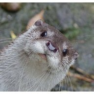
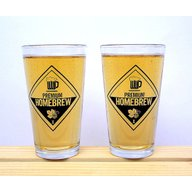
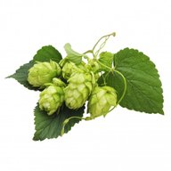

# Batches #31-#40

|   | Batch # | Recipe | Status | ABV | IBU | EBC | OG | FG | BJCP Style | Type |
|---|---------|--------|--------|-----|-----|-----|----|----|------------|------|
|  | 31 | [AnOtter Bodged Bitter v2]()| Completed | 5.3 | 33 | 13 | 1.044 | 1.007 | 11A Ordinary Bitter | All Grain |
|  | 32 | [AnOtter Bodged Bitter v3]()| Completed | 5.3 | 29 | 13 | 1.044 | 1.007 | 11A Ordinary Bitter | All Grain |
|  | 33 | [SMaSH Fuggle v2]()| Completed | 5.0 | 34 | 9.1 | 1.044 | 1.010 | 12A British Golden Ale | All Grain |
|  | 34 | [Two Pints and a Packet of Hops (Fuggle and Progress) v2]()| Completed | 5.0 | 34 | 9.1 | 1.044 | 1.010 | 12A British Golden Ale | All Grain |
|  | 35 | [Two Pints and a Packet of Hops (Fuggle and East Kent Goldings) v2]()| Completed | 4.7 | 34 | 9.1 | 1.044 | 1.012 | 12A British Golden Ale | All Grain |
|  | 36 | [Juniper Ascending]() | Completed |  4.9 | 7 | 13 | 1.045 | 1.010 | 27 Historical Beer (Kornøl) | All Grain |
|  | 37 | [Juniper Ascending v2]() | Completed | 4.7 | 7 | 13 | 1.045 | 1.011 | 27 Historical Beer (Kornøl) | All Grain |
|  | 38 | [Juniper Ascending v3]() | Completed | 4.9 | 7 | 20 | 1.045 | 1.010 | 27 Historical Beer (Kornøl) | All Grain |
|  | 39 | [Wet Hops Blonde Ale (Willamette) v2 (2023)](batch_39/README.md) | Completed | 4.6 | 27 | 10.2 | 1.041 | 1.006 | 18A Blonde Ale | All Grain |
|  | 40 | [Wet Hops Blonde Ale (Willamette) v2 (2024)](batch_40/README.md) | Completed | 3.8 | 21 | 7.9 | 1.032 | 1.006 | 18A Blonde Ale | All Grain |
