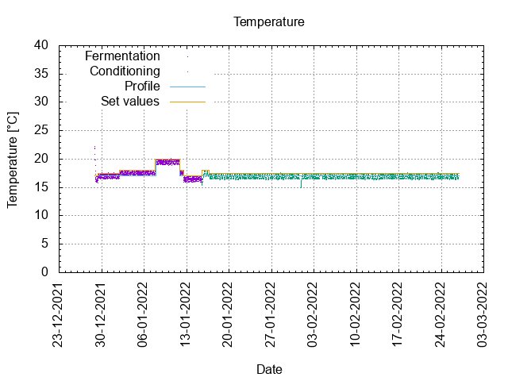
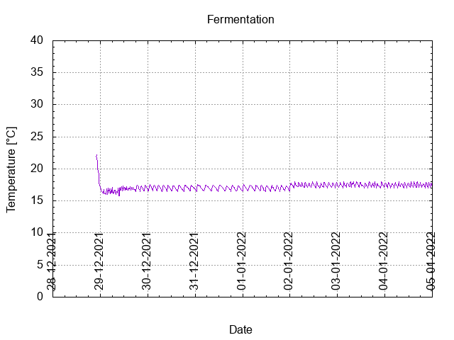
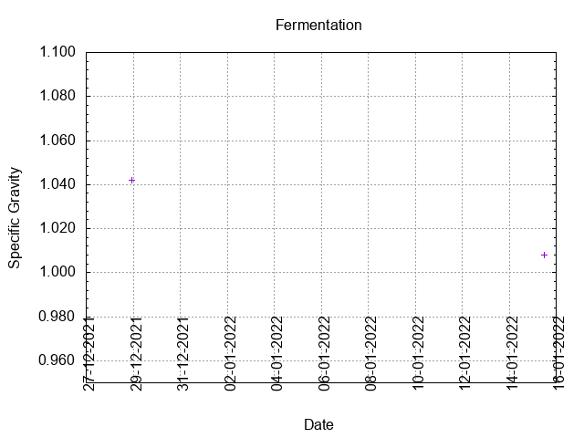
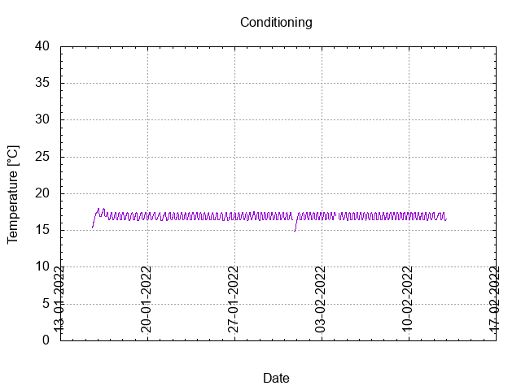
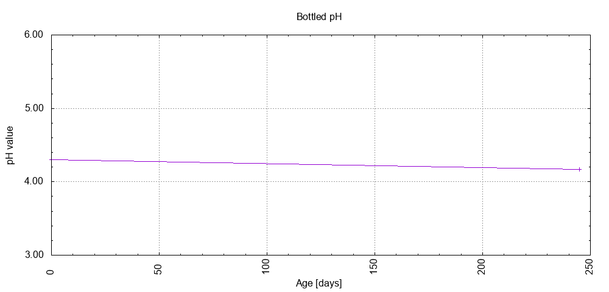

# Batch #18 - Three Hops Blonde v3

## Milestones

28-12-2021 11:00 Start brewing.

28-12-2021 22:00 Start fermentation.

15-01-2022 12:20 Start conditioning.

26-02-2022 19:07 Completed conditioning.

17-09-2022 19:35 Archived.

## Process

[Results](./Batch_18_Three_Hops_Blonde_v3_results.pdf)

### Evaluation

|                         | Recipe | Batch | Diff   | Unit |
|-------------------------|--------|-------|--------|------|
| Batch Volume:           | 1.2    | 1.0   | -0.2   | L    |
| Trub/Chiller Loss:      | 0.6    | 0.8   | +0.2   | L    |
| Bottling Volume:        | 1.2    | 0.66  | -0.54  | L    |
| Original Gravity:       | 1.040  | 1.042 | +0.002 |      |
| Total Gravity:          | 1.042  | 1.044 | +0.002 |      |
| Final Gravity:          | 1.007  | 1.008 | +0.001 |      |
| Alcohol By Volume:      | 4.6    | 5.0   | +0.4   | %    |
| Apparent Attenuation:   | 82.8   | 82.0  | -0.8   | %    |
| Brewhouse Efficiency:   | 53     | 46    | -6     | %    |
| IBU:                    | 24     | 22    | -2     |      |
| BU/GU Ratio:            | 0.56   | 0.50  | -0.06  |      |
| RB Ratio:               | 0.60   | 0.54  | -0.06  |      |
| Color                   | 7.7    | 7.7   |  0     | EBC  |
| Mash pH:                | 4.62   | 5.33  | +0.71  |      |

## Tasting notes

| No. | Date       | Age | Score | Notes |
|-----|------------|-----|-------|-------|
|     | 28-12-2021 |   0 |       | Brew day. |
|     | 15-01-2022 |  18 |       | Bottling day. |
|   1 | 25-03-2022 |  87 | 3.00  | A clear Blonde with a decent foam layer which remains. Strong on hops, sweet, citrusy. Crisp, dry mouthfeel. |
|   2 | 17-09-2022 | 263 | 2.75  | A cloudy/hazy blonde with a decent foam layer. Highly carbonated.Stron hops, dank, herbal flavor. Dry mouthfeel. |
