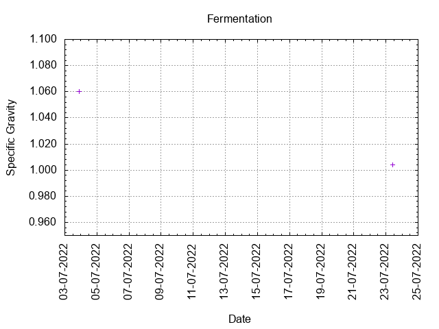
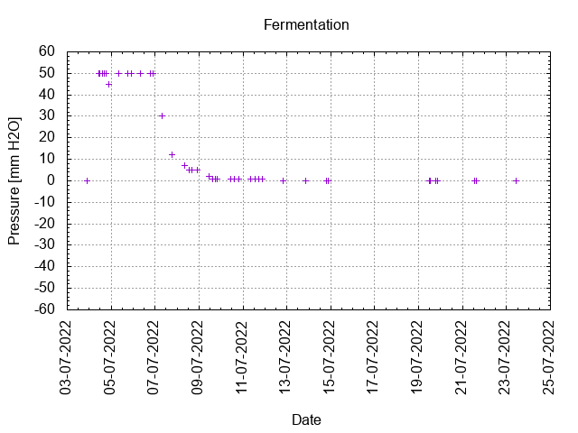
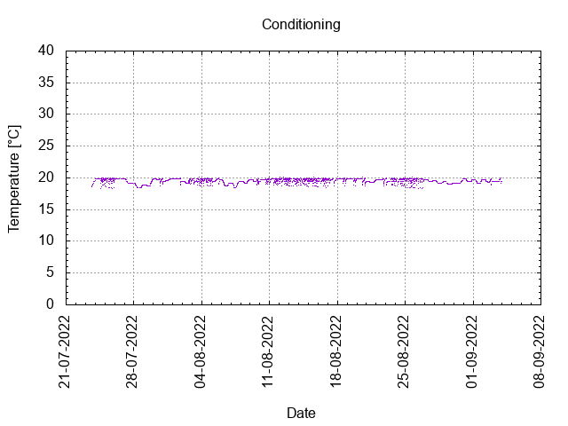

# Batch #19 - Never Give Up!

## Milestones

03-07-2022 10:29 Start brewing.

03-07-2022 21:30 Start fermentation.

23-07-2022 10:30 Start conditioning.

03-09-2022 23:59 Completed conditioning.

Archived.

## Process

[Results](./Batch_19_Never_Give_Up_results.pdf)

### Evaluation

|                         | Recipe | Batch | Diff   | Unit |
|-------------------------|--------|-------|--------|------|
| Pre-Boil Volume:        | 7.76   | 8.0   | +0.24  | L    |
| Post-Boil Volume (HOT): | 5.96   | 6.5   | +0.54  | L    |
| Boil Off per Hour:      | 1.8    | 1.5   | -0.3   | L    |
| Batch Volume:           | 5.6    | 5.0   | -0.6   | L    |
| Trub/Chiller Loss:      | 0.12   | 1.24  | +1.12  | L    |
| Bottling Volume:        | 5      | 3.96  | -1.04  | L    |
| Pre-Boil Gravity:       | 1.046  | 1.038 | -0.008 |      |
| Post-Boil Gravity:      | 1.070  | 1.060 | -0.010 |      |
| Original Gravity:       | 1.070  | 1.060 | -0.010 |      |
| Total Gravity:          | 1.073  | 1.063 | -0.010 |      |
| Final Gravity:          | 1.007  | 1.004 | -0.003 |      |
| Alcohol By Volume:      | 8.7    | 7.9   | -0.8   | %    |
| Apparent Attenuation:   | 89.9   | 93.4  | +3.5   | %    |
| Mash Efficiency:        | 73     | 62    | -11    | %    |
| Brewhouse Efficiency:   | 72     | 55    | -17    | %    |
| IBU:                    | 29     | 29    | 0      |      |
| BU/GU Ratio:            | 0.40   | 0.45  | +0.05  |      |
| RB Ratio:               | 0.45   | 0.53  | +0.08  |      |
| Color                   | 7.9    | 7.3   | -0.6   | EBC  |
| Mash pH:                | 5.38   | 5.30  | -0.08  |      |

## Tasting notes

| No. | Date       | Age | Score | Notes |
|-----|------------|-----|-------|-------|
|     | 23-07-2022 |   0 |       | Bottling day. |
|   1 | 21-08-2022 |  29 |  3.00 | A slightly hazy Belgian Golden Strong ale with a decent foam layer which remains. Strong on hops, sweet, citrusy. Crisp, dry mouthfeel. |
|   2 | 14-10-2022 |  83 |  3.00 | A slightly hazy Belgian Golden Strong ale with a decent foam layer which remains. Strong on hops, sweet, citrusy. Crisp, dry mouthfeel. |
|   3 | 03-05-2023 | 284 |       | Tasting by Clibit: Tonight's treat is a bottle of Belgian Strong Ale, hand delivered from the Low Countries by TTO. I'm not an expert with this style by any stretch, I rarely drink big beers of any kind. But this is a treat, I'm very much enjoying it as a nice change. It does remind me a bit of the Westmalle Tripel I had last year. I detect no faults with it. There's a big sweet pilsner malt base, the alcohol is a big influence, in a good way - there's no fusels - and the yeast is how I like it in a Belgian beer - not extreme phenolics, it makes for a very balanced beer. I really do think you made a great job of this beer Thirsty, I would be chuffed to have brewed this myself. Cheers big man. |
|   4 | 02-03-2023 | 222 |       | Tasting by Clibit pending |
|   5 | 05-05-2023 | 286 |  3.00 | A slightly hazy Belgian Golden Strong ale with a decent foam layer which remains. Strong on hops, sweet, citrusy. Crisp, dry mouthfeel. |
|   6 | 26-10-2024 | 826 |  3.00 | Tasting by Eric Verheyen pending. |
|   7 |            |     |       |  |
|   8 |            |     |       |  |
|   9 |            |     |       |  |
|  10 |            |     |       |  |
|  11 |            |     |       |  |
|  12 |            |     |       |  |
