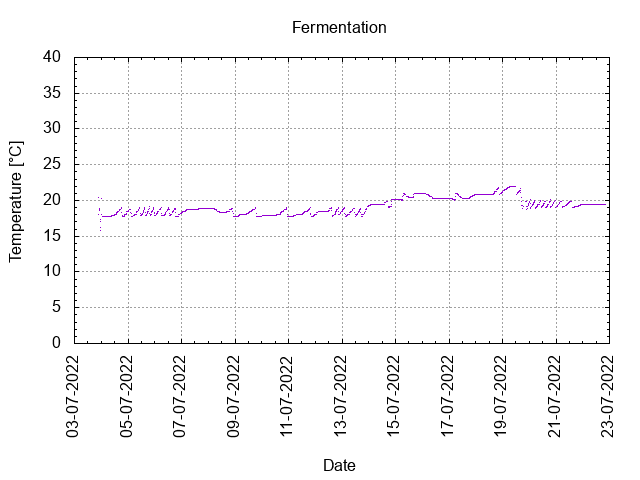
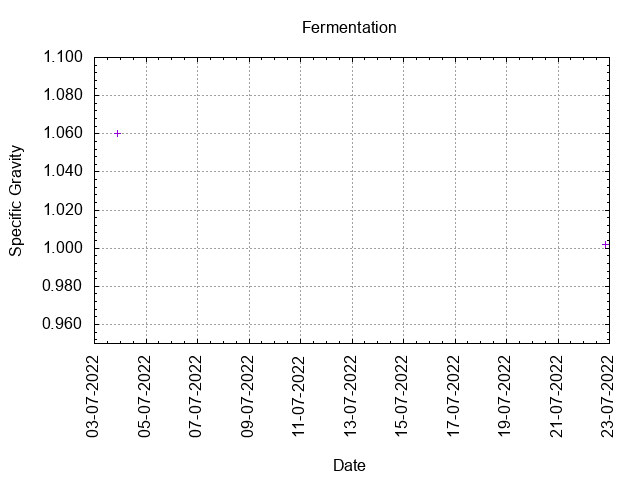
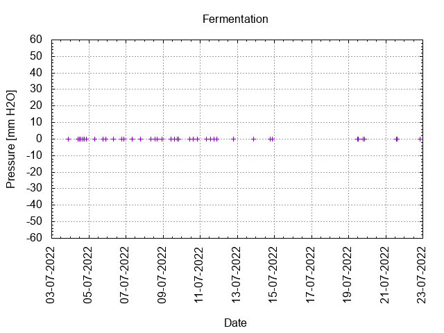
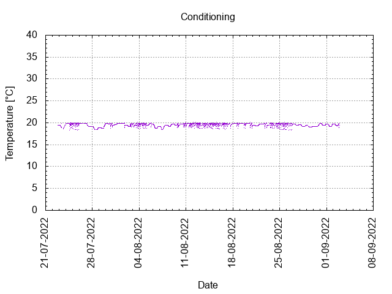

# Batch #20 - Never Give Up! v2

## Milestones

03-07-2022 10:29 Start brewing.

03-07-2022 21:30 Start fermentation.

22-07-2022 20:00 Start conditioning.

02-09-2022 23:59 Completed conditioning.

15-12-2024 17:34 Archived.

## Process

[Results](./Batch_20_Never_Give_Up_v2_results.pdf)

### Evaluation

|                         | Recipe | Batch | Diff   | Unit |
|-------------------------|--------|-------|--------|------|
| Batch Volume:           | 0.75   | 0.75  | 0      | L    |
| Bottling Volume:        | 0.75   | 0.66  | -0.09  | L    |
| Post-Boil Gravity:      | 1.070  | 1.061 | -0.009 |      |
| Original Gravity:       | 1.070  | 1.060 | -0.010 |      |
| Total Gravity:          | 1.073  | 1.063 | -0.010 |      |
| Final Gravity:          | 1.007  | 1.002 | -0.005 |      |
| Alcohol By Volume:      | 8.7    | 8.0   | -0.7   | %    |
| Apparent Attenuation:   | 89.9   | 96.6  | +6.7   | %    |
| Brewhouse Efficiency:   | 95     | 81    | -14    | %    |
| IBU:                    | 28     | 28    | 0      |      |
| BU/GU Ratio:            | 0.39   | 0.45  | +0.06  |      |
| RB Ratio:               | 0.44   | 0.54  | +0.10  |      |
| Color                   | 6.7    | 6.7   | 0      | EBC  |

## Tasting notes

| No. | Date       | Age | Score | Notes |
|-----|------------|-----|-------|-------|
|     | 22-07-2022 |   0 |       | Bottling day. |
|   1 | [09-10-2022](20221009_Batch_20_Never_Give_Up_v2_BJCP_Scoresheet-1_2.pdf) |  79 | 2.50  | Served @ 11.3 C. Strong, warm, yeasty, malty, not much hop flavours. Low carbonation. |
|   2 | 15-12-2024 | 877 | 2.50  | Served @ 17.8 C. Strong, warm, yeasty, malty, not much hop flavours. Low carbonation. This bottle gave hop gunk during pouring. |
