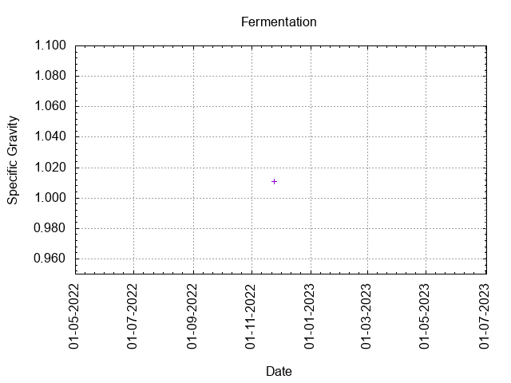
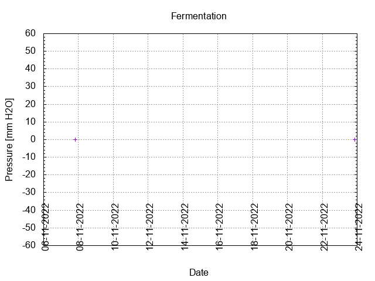
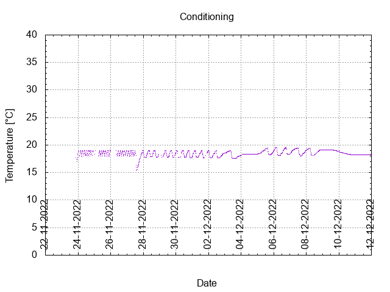
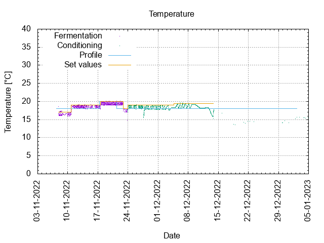
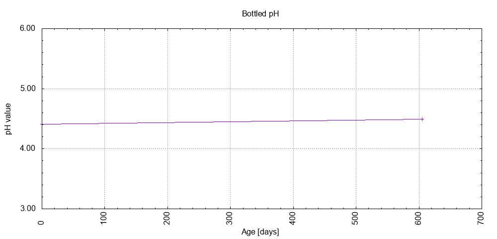

# Batch #25 - Two Pints and a Packet of Hops (Fuggle and East Kent Goldings)

## Milestones

06-11-2022 Start brewing.

07-11-2022 Start fermentation.

23-11-2022 Start conditioning.

04-01-2023 Completed conditioning.

20-07-2024 Archived.

## Process

[Results](./Batch_25_Two_Pints_and_a_Packet_of_Hops_Fuggle_and_East_Kent_Goldings_results.pdf)

### Evaluation

| Split off Batch 24      | Recipe | Batch | Diff   | Unit |
|-------------------------|--------|-------|--------|------|
| Batch Volume:           | 0.75   | 0.75  |  0     | L    |
| Bottling Volume:        | 0.66   | 0.66  |  0     | L    |
| Post-Boil Gravity:      | 1.037  | 1.037 |  0     |      |
| Original Gravity:       | 1.037  | 1.037 |  0     |      |
| Total Gravity:          | 1.044  | 1.039 | -0.005 |      |
| Final Gravity:          | 1.012  | 1.011 | -0.001 |      |
| Alcohol By Volume:      | 4.2    | 3.7   | -0.5   | %    |
| Apparent Attenuation:   | 72     | 71.1  | -0.9   | %    |
| Brewhouse Efficiency:   | 72     | 72    |  0     | %    |
| IBU:                    | 29     | 29    |  0     |      |
| BU/GU Ratio:            | 0.65   | 0.74  | +0.09  |      |
| RB Ratio:               | 0.62   | 0.70  | +0.08  |      |
| Color                   | 12.8   | 12.8  |  0     | EBC  |
| Mash pH:                | 5.38   | 5.27  | -0.11  |      |

## Tasting notes

| No. | Date       | Age | Score | Notes |
|-----|------------|-----|-------|-------|
|     | 23-11-2022 |   0 |       | Bottling day. |
|   1 | [29-12-2022](20221229_Batch_25_Two_Pints_and_a_Packet_of_Hops_Fuggle_and_EKG_BJCP_Scoresheet-1_2.pdf) |  36 | 3.25  | Served at 16.2 C. Has a nice body, floral, malty, yeasty, warm mouthfeel, no off flavours. |
|   2 | [20-07-2024](20240720_Batch_25_Two_Pints_and_a_Packet_of_Hops_Fuggle_and_EKG_BJCP_Scoresheet-2_2.pdf) | 605 | 3.25  | Served at 16.2 C. Has a nice body, floral, malty, yeasty, warm mouthfeel, no off flavours. |
