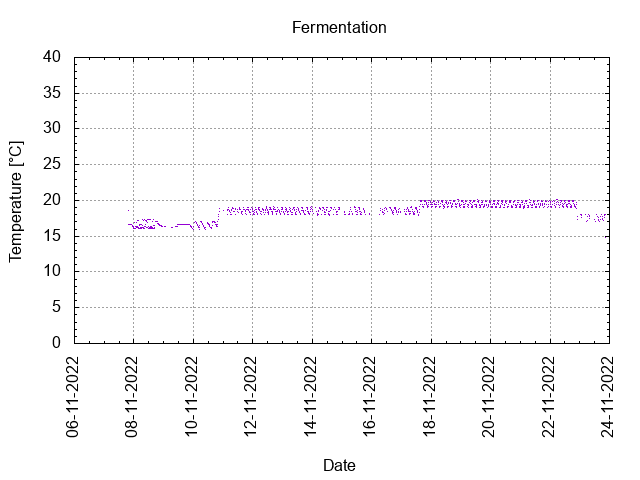
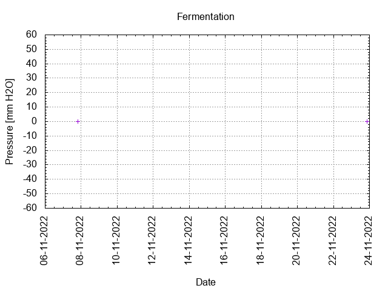
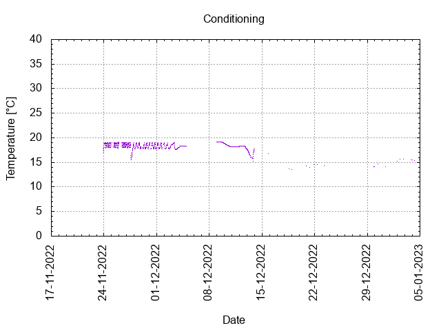

# Batch #26 - Two Pints and a Packet of Hops (Fuggle and Progress)

## Milestones

06-11-2022 Start brewing.

07-11-2022 Start fermentation.

23-11-2022 Start conditioning.

04-01-2023 Completed conditioning.

Archived.

## Process

[Results](./Batch_26_Two_Pints_and_a_Packet_of_Hops_Fuggle_and_Progress_results.pdf)

### Evaluation

|                         | Recipe | Batch | Diff   | Unit |
|-------------------------|--------|-------|--------|------|
| Batch Volume:           | 0.75   | 0.75  | 0      | L    |
| Trub/Chiller Loss:      | 0.12   | 0.12  | 0      | L    |
| Bottling Volume:        | 0.63   | 0.66  | +0.03  | L    |
| Original Gravity:       | 1.037  | 1.037 | 0      |      |
| Total Gravity:          | 1.044  | 1.039 | -0.005 |      |
| Final Gravity:          | 1.012  | 1.013 | +0.001 |      |
| Alcohol By Volume:      | 4.2    | 3.4   | -0.8   | %    |
| Apparent Attenuation:   | 72.0   | 65.9  | -6.1   | %    |
| Brewhouse Efficiency:   | 72     | 72    | 0      | %    |
| IBU:                    | 27     | 27    | 0      |      |
| BU/GU Ratio:            | 0.61   | 0.69  | +0.08  |      |
| RB Ratio:               | 0.58   | 0.62  | +0.02  |      |
| Color                   | 10.8   | 10.8  | 0      | EBC  |

## Tasting notes

| No. | Date       | Age | Score | Notes |
|-----|------------|-----|-------|-------|
|     | 23-11-2022 |   0 |       | Bottling day. |
|   1 | [12-01-2023](20230112_Batch_26_Two_Pints_and_a_Packet_of_Hops_Fuggle_and_Progress_BJCP_Scoresheet-1_2.pdf) |  50 | 3.25  | Served at 18.6 C. Has a nice body, malty, yeasty, warm mouthfeel, no off flavours. |
|   2 |            |     |       |  |
