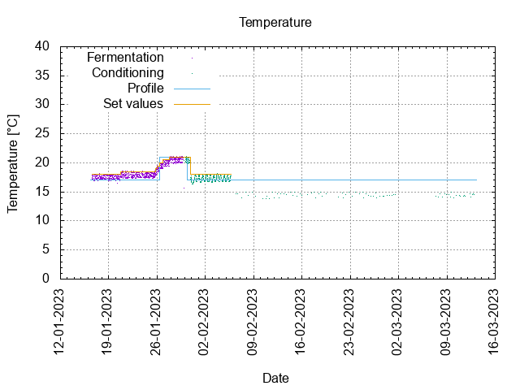
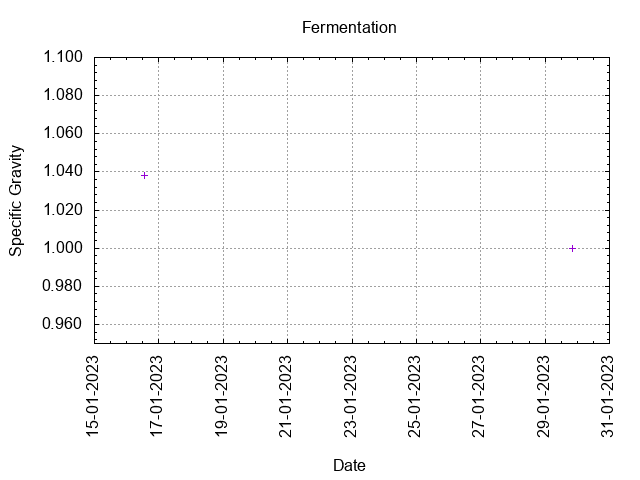

# Batch #28 - Two Pints and a Packet of Hops (Godiva and Progress)

## Milestones

15-01-2023 10:20 Start brewing.

16-01-2023 13:00 Start fermentation.

29-01-2023 20:15 Start conditioning.

12-03-2023 23:00 Completed conditioning.

29-12-2023 16:37 Archived.

## Process

[Results](./Batch_28_Two_Pints_and_a_Packet_of_Hops_Godiva_and_Progress_results.pdf)

### Evaluation

|                         | Recipe | Batch | Diff   | Unit |
|-------------------------|--------|-------|--------|------|
| Batch Volume:           | 0.75   | 0.80  | +0.05  | L    |
| Trub/Chiller Loss:      | 0      | 0.14  | +0.14  | L    |
| Bottling Volume:        | 0.75   | 0.66  | -0.09  | L    |
| Original Gravity:       | 1.039  | 1.038 | -0.001 |      |
| Total Gravity:          | 1.041  | 1.040 | -0.001 |      |
| Final Gravity:          | 1.009  | 1.000 | -0.009 |      |
| Alcohol By Volume:      | 4.2    | 5.3   | +1.1   | %    |
| Apparent Attenuation:   | 77.4   | 100   | +22.6  | %    |
| Brewhouse Efficiency:   | 95     | 99    | +4     | %    |
| IBU:                    | 31     | 31    | 0      |      |
| BU/GU Ratio:            | 0.76   | 0.78  | +0.02  |      |
| RB Ratio:               | 0.77   | 0.96  | +0.19  |      |
| Color                   | 6.5    | 6.5   | 0      | EBC  |

## Tasting notes

| No. | Date       | Age | Score | Notes |
|-----|------------|-----|-------|-------|
|     | 29-01-2023 |   0 |       | Bottling day. |
|   1 | 23-03-2023 |  53 |  0.5  | Served @ 18.8 C. Gusher, acidic, gunks of hop. Not a good one. Plonk beer. |
|   2 | 29-12-2023 | 334 |  0.5  | Served @ 16.7 C. Gusher, acidic, gunks of hop. Not a good one. Plonk beer. |
