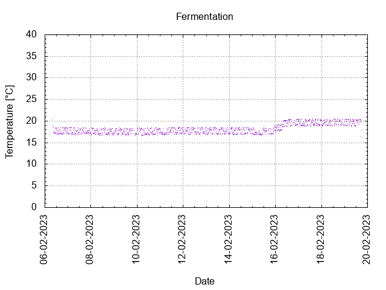
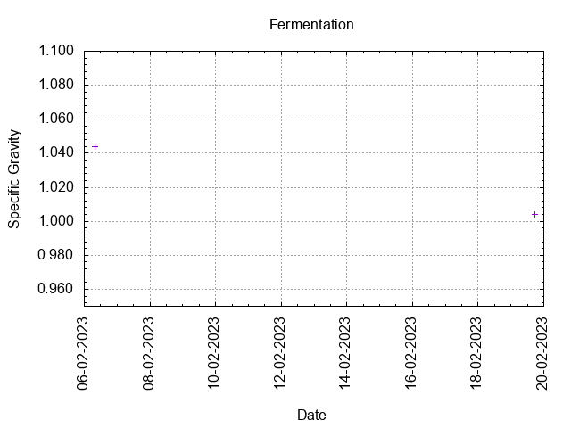
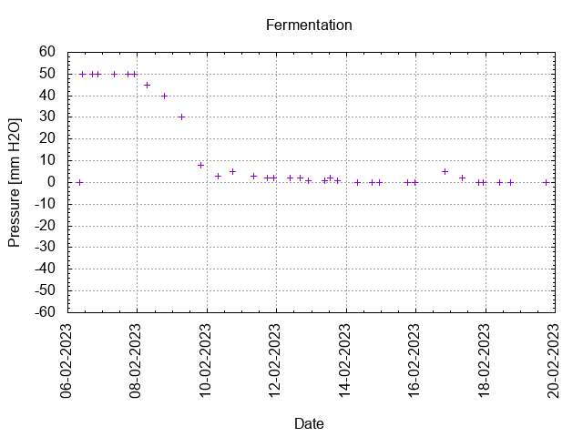
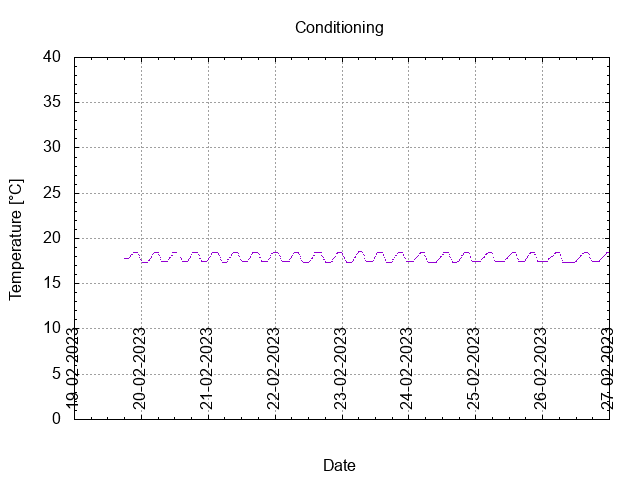
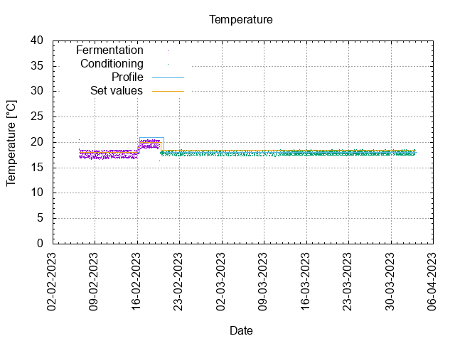
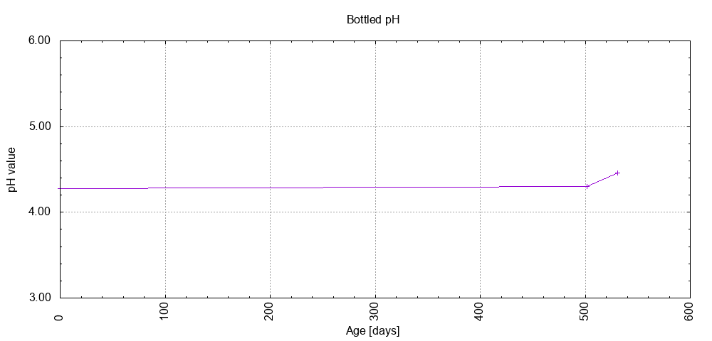

# Batch #30 - AnOtter Bodged Bitter

## Milestones

05-02-2023 10:00 Start brewing.

06-02-2023 08:00 Start fermentation.

19-02-2023 17:25 Start conditioning.

02-04-2023 Completed conditioning.

Archived.

## Process

[Results](./Batch_30_AnOtter Bodged Bitter_results.pdf)

### Evaluation

|                         | Recipe | Batch | Diff   | Unit |
|-------------------------|--------|-------|--------|------|
| Pre-Boil Volume:        | 8.06   | 7.5   | -0.56  | L    |
| Post-Boil Volume (HOT): | 5.96   | 5.9   | -0.06  | L    |
| Boil Off per Hour:      | 1.8    | 1.37  | -0.43  | L    |
| Batch Volume:           | 5.6    | 2.8   | -2.8   | L    |
| Trub/Chiller Loss:      | 0.12   | 2.86  | +2.74  | L    |
| Bottling Volume:        | 5      | 2.31  | -2.69  | L    |
| Pre-Boil Gravity:       | 1.024  | 1.031 | +0.007 |      |
| Post-Boil Gravity:      | 1.036  | 1.044 | +0.008 |      |
| Original Gravity:       | 1.036  | 1.044 | +0.008 |      |
| Total Gravity:          | 1.038  | 1.047 | +0.009 |      |
| Final Gravity:          | 1.007  | 1.004 | -0.003 |      |
| Alcohol By Volume:      | 4.1    | 5.6   | +1.5   | %    |
| Apparent Attenuation:   | 81.1   | 91.2  | +10.1  | %    |
| Mash Efficiency:        | 73     | 88    | +15    | %    |
| Brewhouse Efficiency:   | 72     | 44    | -28    | %    |
| IBU:                    | 31     | 30    | -1     |      |
| BU/GU Ratio:            | 0.81   | 0.64  | -0.17  |      |
| RB Ratio:               | 0.85   | 0.73  | -0.12  |      |
| Color                   | 13.4   | 13.6  | +0.2   | EBC  |
| Mash pH:                | 5.4    | 5.4   | 0      |      |

## Tasting notes

| No. | Date       | Age | Score | Notes |
|-----|------------|-----|-------|-------|
|     | 05-02-2023 |     |       | Brew day. |
|     | 19-02-2023 |   0 |       | Bottling day. |
|   1 | 02-03-2023 |  11 |       | 11th Home Brewing UK Competition entry. |
|   2 | 02-03-2023 |  11 |       | 11th Home Brewing UK Competition entry. |
|   3 | [11-03-2023](20230311_Batch_30_AnOtter_Bodged_Bitter_BJCP_Scoresheet-3_7.pdf) |  20 | 2.50  | Served @ 17.4 C. Dry, malty, hoppy, berries. Low carbonation. |
|   4 | [05-07-2024](20240705_Batch_30_AnOtter_Bodged_Bitter_BJCP_Scoresheet-4_7.pdf) | 502 | 3.00  | Served @ 17.4 C. Dry, malty, hoppy, berries. Good foamy lasting head. Low carbonation. |
|   5 | 03-08-2024 | 531 | 0     | Gusher. |
|   6 |            |     |       |  |
|   7 |            |     |       |  |
