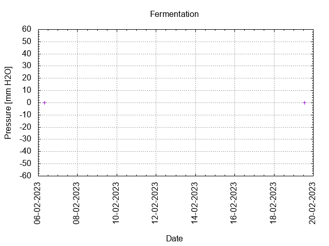

# Batch #31 - AnOtter Bodged Bitter v2

## Milestones

05-02-2023 Start brewing.

06-02-2023 Start fermentation.

19-02-2023 Start conditioning.

02-04-2023 Completed conditioning.

19-07-2024 Archived.

## Process

[Results](./Batch_31_AnOtter_Bodged_Bitter_v2_results.pdf)

### Evaluation

|                         | Recipe | Batch | Diff   | Unit |
|-------------------------|--------|-------|--------|------|
| Batch Volume:           | 1.2    | 1.2   | 0      | L    |
| Trub/Chiller Loss:      | 0      | 0.54  | 0      | L    |
| Bottling Volume:        | 1.2    | 0.66  | -0.54  | L    |
| Original Gravity:       | 1.036  | 1.044 | +0.008 |      |
| Total Gravity:          | 1.037  | 1.047 | +0.010 |      |
| Final Gravity:          | 1.007  | 1.007 | 0      |      |
| Alcohol By Volume:      | 3.9    | 5.3   | +1.4   | %    |
| Apparent Attenuation:   | 80.6   | 84.6  | +4.0   | %    |
| Brewhouse Efficiency:   | 53     | 64    | +11    | %    |
| IBU:                    | 31     | 31    | 0      |      |
| BU/GU Ratio:            | 0.82   | 0.65  | -0.17  |      |
| RB Ratio:               | 0.85   | 0.70  | -0.15  |      |
| Color                   | 12.8   | 12.8  | 0      | EBC  |

## Tasting notes

| No. | Date       | Age | Score | Notes |
|-----|------------|-----|-------|-------|
|     | 19-02-2023 |   0 |       | Bottling day. |
|   1 | 08-06-2023 | 109 | 3.0   | Served @ 13.4 C. Clear, foamy head, good lacing, hints of berries, malty, moderate mouthfeel. |
|   2 | 19-07-2024 | 516 | 3.0   | Served @ 16.5 C. Clear, small foamy head, poor lacing, sweet, malty, bitter, hoppy, moderate mouthfeel. |
