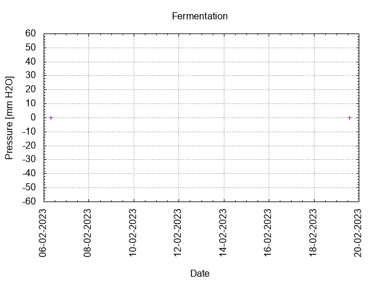
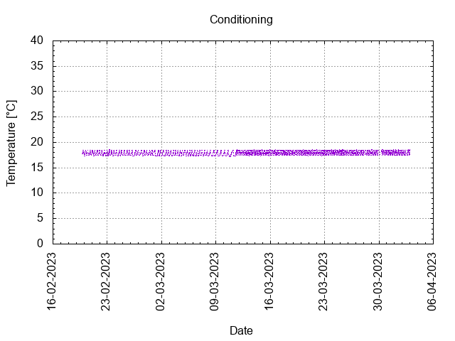

# Batch #32 - AnOtter Bodged Bitter v3

## Milestones

05-02-2023 10:00 Start brewing.

06-02-2023 07:42 Start fermentation.

19-02-2023 15:41 Start conditioning.

02-04-2023 23:59 Completed conditioning.

Archived.

## Process

[Results](./Batch_32_AnOtter_Bodged_Bitter_v3_results.pdf)

### Evaluation

|                         | Recipe | Batch | Diff   | Unit |
|-------------------------|--------|-------|--------|------|
| Batch Volume:           | 1.2    | 1.2   | 0      | L    |
| Trub/Chiller Loss:      | 0.6    | 0.54  | -0.06  | L    |
| Bottling Volume:        | 0.6    | 0.66  | +0.06  | L    |
| Original Gravity:       | 1.036  | 1.044 | +0.008 |      |
| Final Gravity:          | 1.037  | 1.047 | +0.010 |      |
| Total Gravity:          | 1.007  | 1.007 | 0      |      |
| Alcohol By Volume:      | 3.9    | 5.3   | +1.4   | %    |
| Apparent Attenuation:   | 80.6   | 84.6  | +4.0   | %    |
| Brewhouse Efficiency:   | 53     | 64    | +11    | %    |
| IBU:                    | 27     | 27    | 0      |      |
| BU/GU Ratio:            | 0.72   | 0.58  | -0.14  |      |
| RB Ratio:               | 0.75   | 0.63  | -0.12  |      |
| Color                   | 12.8   | 12.8  | 0      | EBC  |

## Tasting notes

| No. | Date       | Age | Score | Notes |
|-----|------------|-----|-------|-------|
|     | 05-02-2023 |     |       | Brew day. |
|     | 19-02-2023 |   0 |       | Bottling day. |
|   1 | [24-06-2023](20230624_Batch_32_AnOtter_Bodged_Bitter_v3_BJCP_Scoresheet-1_2.pdf) | 125 | 3.0   | Served @ 12.1 C. Clear, foamy head, moderate lacing, hints of berries, malty, moderate mouthfeel. |
|   2 |            |     |       |  |
