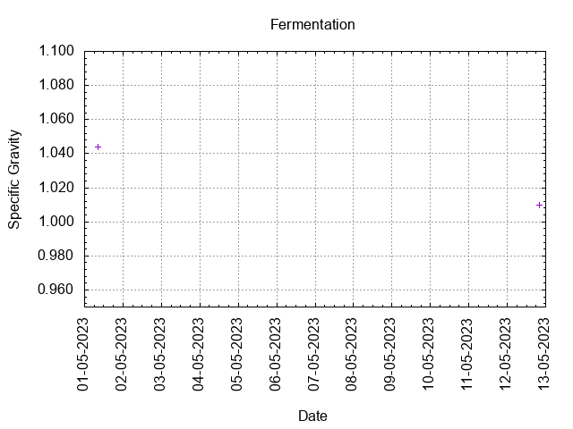
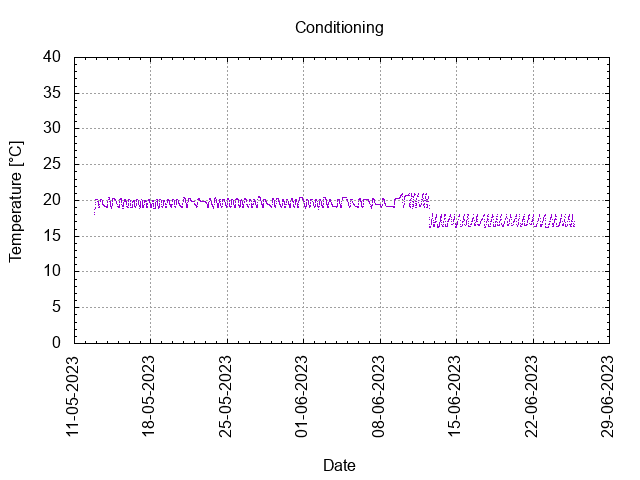

# Batch #33 - SMaSH Fuggle v2

## Milestones

30-04-2023 09:00 Start brewing.

01-05-2023 08:13 Start fermentation.

12-05-2023 20:00 Start conditioning.

26-06-2023 23:59 Completed conditioning.

Archived.

## Process

[Results](./Batch_33_SMaSH_Fuggle_v2_results.pdf)

### Evaluation

|                         | Recipe | Batch | Diff   | Unit |
|-------------------------|--------|-------|--------|------|
| Pre-Boil Volume:        | 7.76   | 8.25  | +0.49  | L    |
| Post-Boil Volume (HOT): | 5.96   | 5.2   | -0.76  | L    |
| Boil Off per Hour:      | 1.8    | 3.05  | +1.25  | L    |
| Batch Volume:           | 5.6    | 3.5   | -2.1   | L    |
| Trub/Chiller Loss:      | 0.12   | 1.49  | +1.37  | L    |
| Bottling Volume:        | 5.0    | 2.64  | -2.36  | L    |
| Pre-Boil Gravity:       | 1.030  | 1.026 | -0.004 |      |
| Post-Boil Gravity:      | 1.039  | 1.044 | +0.005 |      |
| Original Gravity:       | 1.039  | 1.044 | +0.005 |      |
| Total Gravity:          | 1.041  | 1.048 | +0.007 |      |
| Final Gravity:          | 1.009  | 1.010 | +0.001 |      |
| Alcohol By Volume:      | 4.2    | 5.0   | +0.8   | %    |
| Apparent Attenuation:   | 77.4   | 78.5  | +1.1   | %    |
| Mash Efficiency:        | 73     | 68    | -5     | %    |
| Brewhouse Efficiency:   | 72     | 51    | -21    | %    |
| IBU:                    | 26     | 32    | +6     |      |
| BU/GU Ratio:            | 0.64   | 0.67  | +0.03  |      |
| RB Ratio:               | 0.65   | 0.68  | +0.03  |      |
| Color                   | 7.7    | 8.5   | +0.8   | EBC  |
| Mash pH:                | 5.35   | 5.38  | +0.03  |      |

## Tasting notes

| No. | Date       | Age | Score | Notes |
|-----|------------|-----|-------|-------|
|     | 30-04-2023 |     |       | Brew day. |
|     | 12-05-2023 |   0 |       | Bottling day. |
|   1 | [29-06-2023](20230629_Batch_33_SMaSH_Fuggle_v2_BJCP_Scoresheet-1_8.pdf) |  48 | 3.0   | Served @ 18.4 C. Clear, foamy head, moderate lacing, malty, fruity, moderate mouthfeel. |
|   2 | [30-11-2024](20241130_Batch_33_SMaSH_Fuggle_v2_BJCP_Scoresheet-2_8.pdf) | 568 | 3.0   | Served @ 17.5 C. Hazy, foamy head, moderate lacing, malty, fruity, moderate mouthfeel. Stirred up yeast. |
|   3 |            |     |       |  |
|   4 |            |     |       |  |
|   5 |            |     |       |  |
|   6 |            |     |       |  |
|   7 |            |     |       |  |
|   8 |            |     |       |  |
