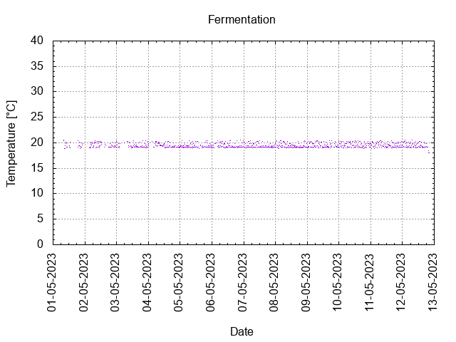

# Batch #34 - Two Pints and a Packet of Hops (Fuggle and Progress) v2

## Milestones

30-04-2023 09:00 Start brewing.

01-05-2023 08:26 Start fermentation.

12-05-2023 19:10 Start conditioning.

26-06-2023 23:59 Completed conditioning.

13-09-2025 20:08 Archived.

## Process

[Results](./Batch_34_Two_Pints_and_a_Packet_of_Hops_Fuggle_and_Progress_v2_results.pdf)

### Evaluation

|                         | Recipe | Batch | Diff   | Unit |
|-------------------------|--------|-------|--------|------|
| Batch Volume:           | 1.2    | 0.75  | -0.45  | L    |
| Trub/Chiller Loss:      | 0      | 0.09  | +0.09  | L    |
| Bottling Volume:        | 1.2    | 0.66  | -0.54  | L    |
| Original Gravity:       | 1.039  | 1.044 | +0.005 |      |
| Total Gravity:          | 1.041  | 1.048 | +0.007 |      |
| Final Gravity:          | 1.009  | 1.010 | +0.001 |      |
| Alcohol By Volume:      | 4.2    | 5.0   | +0.8   | %    |
| Apparent Attenuation:   | 77.4   | 78.5  | +1.1   | %    |
| Brewhouse Efficiency:   | 53     | 37    | -16    | %    |
| IBU:                    | 26     | 66?   | +40?   |      |
| BU/GU Ratio:            | 0.62   | 1.37? | +0.75? |      |
| RB Ratio:               | 0.63   | 1.40? | +0.77? |      |
| Color                   | 7.5    | 13.8  | +6.3   | EBC  |

## Tasting notes

| No. | Date       | Age | Score | Notes |
|-----|------------|-----|-------|-------|
|     | 12-05-2023 |   0 |       | Bottling day. |
|   1 | 15-09-2023 | 126 | 3.5   | Served @ 14.7 C. Clear, foamy head, moderate lacing. Clean, hoppy, malty, fruity, moderate mouthfeel. |
|   2 | 13-09-2025 | 855 | 0.5   | Soapy. Past its best. Plonk beer. |
