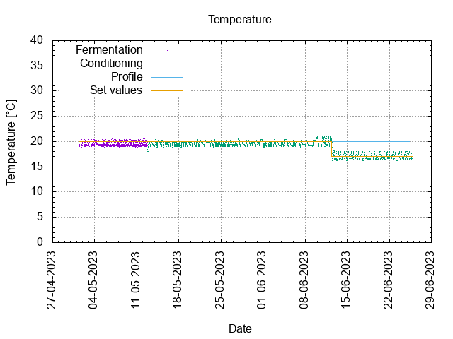
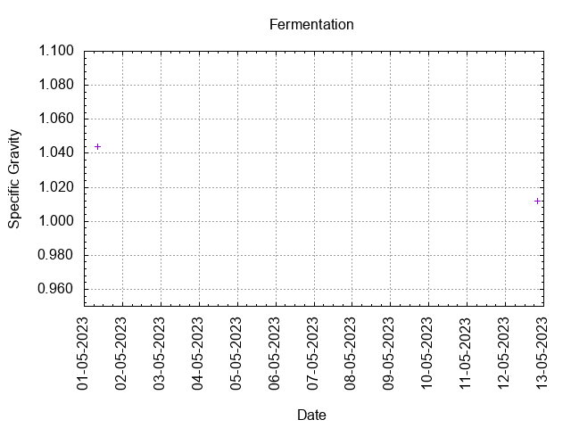
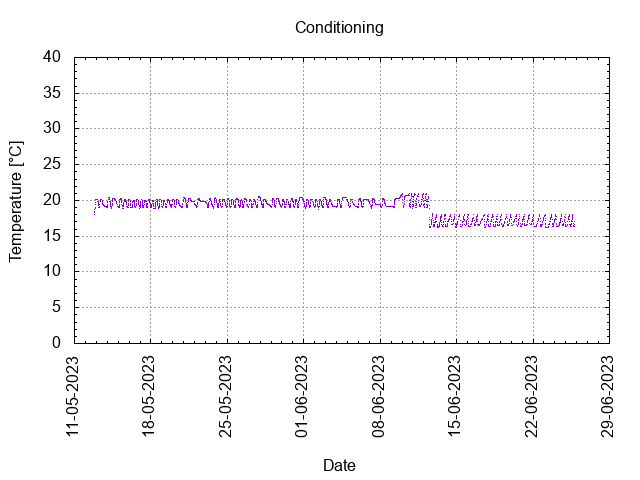
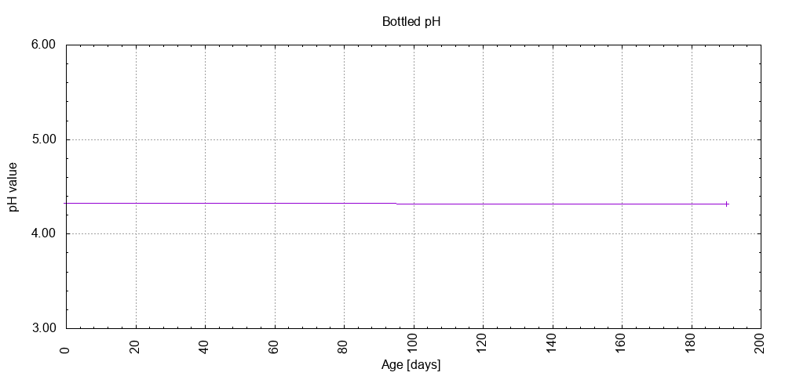

# Batch #35 - Two Pints and a Packet of Hops (Fuggle and East Kent Goldings) v2

## Milestones

30-04-2023 09:00 Start brewing.

01-05-2023 08:26 Start fermentation.

12-05-2023 19:20 Start conditioning.

26-06-2023 23:59 Completed conditioning.

Archived.

## Process

[Results](./Batch_35_Two_Pints_and_a_Packet_of Hops _Fuggle_and_East_Kent_Goldings_v2_results.pdf)

### Evaluation

|                         | Recipe | Batch | Diff   | Unit |
|-------------------------|--------|-------|--------|------|
| Batch Volume:           | 1.2    | 0.75  | -0.45  | L    |
| Trub/Chiller Loss:      | 0      | 0.54  | +0.54  | L    |
| Bottling Volume:        | 1.2    | 0.66  | -0.54  | L    |
| Original Gravity:       | 1.039  | 1.044 | +0.005 |      |
| Total Gravity:          | 1.041  | 1.048 | +0.007 |      |
| Final Gravity:          | 1.009  | 1.012 | +0.003 |      |
| Alcohol By Volume:      | 4.2    | 4.7   | +0.5   | %    |
| Apparent Attenuation:   | 77.4   | 74.2  | -3.2   | %    |
| Brewhouse Efficiency:   | 53     | 37    | -14    | %    |
| IBU:                    | 26     | 66?   | +40?   |      |
| BU/GU Ratio:            | 0.62   | 1.37? | +0.75? |      |
| RB Ratio:               | 0.63   | 1.34? | +0.71? |      |
| Color                   | 7.5    | 13.8  | +6.3   | EBC  |

## Tasting notes

| No. | Date       | Age | Score | Notes |
|-----|------------|-----|-------|-------|
|     | 30-04-2023 |     |       | Brew day. |
|     | 12-05-2023 |   0 |       | Bottling day. |
|   1 | 18-11-2023 | 190 |  3.0  | Served @ 17.1 C. Clear, no foamy head, no moderate lacing. Clean, fruity, hoppy. |
|   2 |            |     |       |  |
