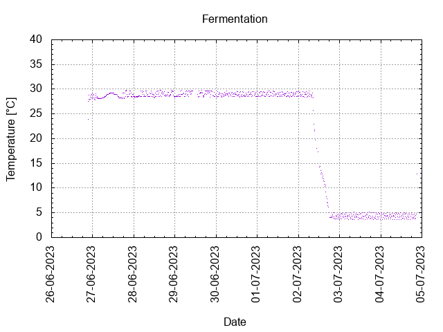
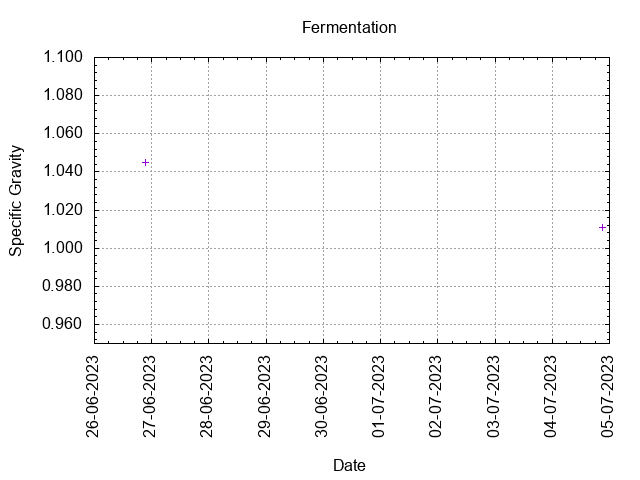
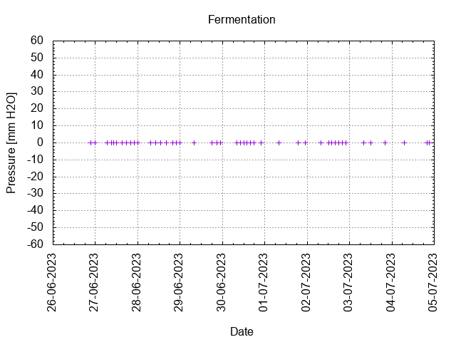

# Batch #38 - Juniper Ascending v3

## Milestones

25-06-2023 12:00 Start brewing.

26-06-2023 21:15 Start fermentation.

04-07-2023 21:40 Start conditioning.

18-07-2023 Completed conditioning.

Archived.

## Process

[Results](./Batch_38_Juniper_Ascending_v3.pdf)

### Evaluation

|                         | Recipe | Batch | Diff   | Unit |
|-------------------------|--------|-------|--------|------|
| Batch Volume:           | 1.2    | 1.0   | -0.2   | L    |
| Trub/Chiller Loss:      | 0      | 0     | 0      | L    |
| Bottling Volume:        | 1.2    | 1.0   | -0.2   | L    |
| Original Gravity:       | 1.062  | 1.045 | -0.017 |      |
| Total Gravity:          | 1.063  | 1.047 | -0.016 |      |
| Final Gravity:          | 1.014  | 1.010 | -0.004 |      |
| Alcohol By Volume:      | 6.4    | 4.9   | -1.5   | %    |
| Apparent Attenuation:   | 76.8   | 78.0  | +1.2   | %    |
| Brewhouse Efficiency:   | 53     | 32    | -21    | %    |
| IBU:                    | 6      | 14    | +8     |      |
| BU/GU Ratio:            | 0.10   | 0.29  | +0.19  |      |
| RB Ratio:               | 0.10   | 0.29  | +0.19  |      |
| Color                   | 11.8   | 18.1  | +6.3   | EBC  |

## Tasting notes

| No. | Date       | Age | Score | Notes |
|-----|------------|-----|-------|-------|
|     | 26-06-2023 |     |       | Brew day. |
|     | 04-07-2023 |   0 |       | Bottling day. |
|   1 | 03-08-2023 |  30 | 3.00  | Served @ 18.6 C. Hazy, small head, moderate lacing, malty, tart, strong Juniper flavor. |
|   2 |            |     |       |  |
|   3 |            |     |       |  |
