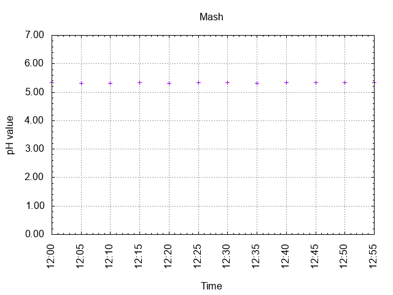
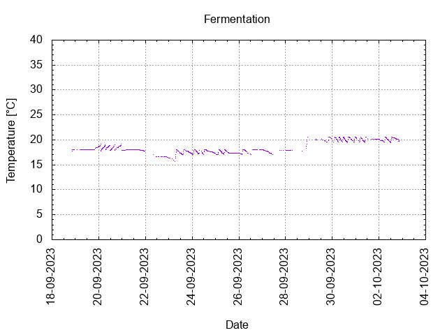
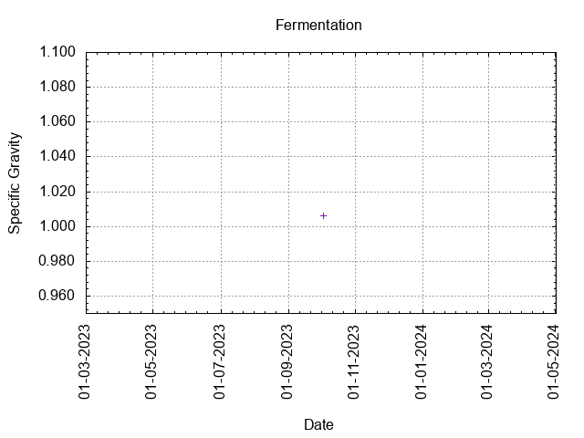
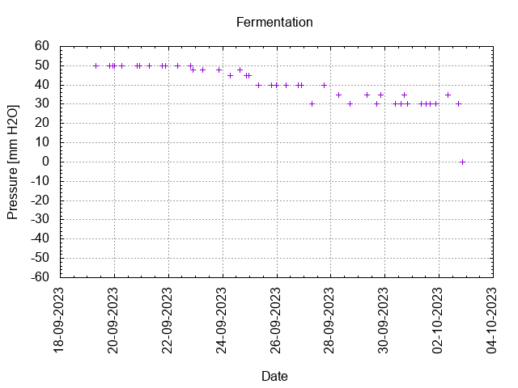
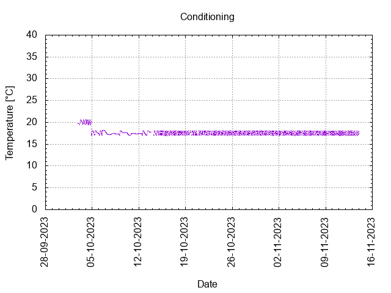
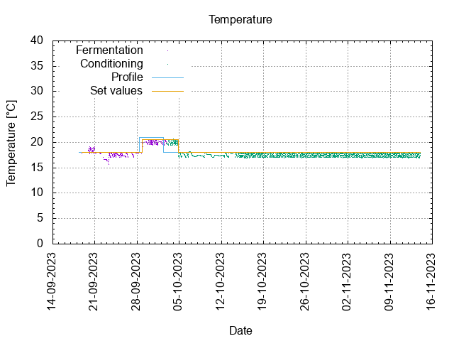
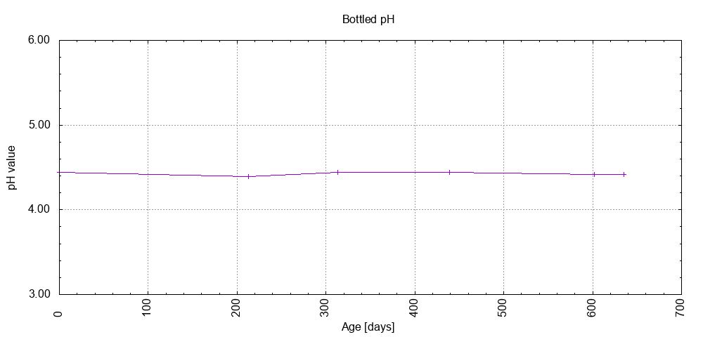

# Batch #39 - Wet Hops Blonde Ale (Willamette) v2

## Milestones

17-09-2023 11:30 Start brewing.

18-09-2023 20:18 Start fermentation.

02-10-2023 20:39 Start conditioning.

13-11-2023 23:59 Completed conditioning.

Archived.

## Process

[Results](./Batch_39_Wet_Hops_Blonde_Ale_Willamette_v2_results.pdf)

## Evaluation

|                         | Recipe | Batch | Diff   | Unit |
|-------------------------|--------|-------|--------|------|
| Pre-Boil Volume:        | 6.86   | 6.0   | -0.86  | L    |
| Post-Boil Volume (HOT): | 5.96   | 5.2   | -0.76  | L    |
| Boil Off per Hour:      | 1.8    | 1.6   | -0.2   | L    |
| Batch Volume:           | 5.6    | 4.5   | -1.1   | L    |
| Trub/Chiller Loss:      | 0.12   | 0.49  | +0.37  | L    |
| Bottling Volume:        | 5.0    | 3.3   | -1.7   | L    |
| Pre-Boil Gravity:       | 1.035  | 1.036 | +0.001 |      |
| Post-Boil Gravity:      | 1.041  | 1.041 |  0     |      |
| Original Gravity:       | 1.041  | 1.041 |  0     |      |
| Total Gravity:          | 1.043  | 1.044 | +0.001 |      |
| Final Gravity:          | 1.010  | 1.006 | -0.04  |      |
| Alcohol By Volume:      | 4.1    | 4.6   | +0.5   | %    |
| Apparent Attenuation:   | 75.0   | 84.9  | +9.9   | %    |
| Mash Efficiency:        | 73     | 66    | -7     | %    |
| Brewhouse Efficiency:   | 72     | 58    | -14    | %    |
| IBU:                    | 23     | 27    | +4     |      |
| BU/GU Ratio:            | 0.57   | 0.65  | +0.08  |      |
| RB Ratio:               | 0.56   | 0.70  | +0.14  |      |
| Color                   | 9.5    | 10.2  | +0.7   | EBC  |
| Mash pH:                | 5.36   | 5.31  | -0.05  |      |

## Tasting notes

| No. | Date       | Age | Score | Notes |
|-----|------------|-----|-------|-------|
|     | 02-10-2023 |   0 |       | Bottling day. |
|   1 | [02-05-2024](20240502_Batch_39_Wet_Hops_Blonde_Ale_Willamette_v2_2023_BJCP_Scoresheet-1_11.pdf) | 213 | 3.50  | Served @ 23.2 C. Clear, small foamy head, good lacing, hoppy, fruity, berries, strong. |
|   2 | [10-08-2024](20240810_Batch_39_Wet_Hops_Blonde_Ale_Willamette_v2_2023_BJCP_Scoresheet-2_11.pdf) | 313 | 3.50  | Served @ 20.0 C. Clear, small foamy head, good lacing, hoppy, fruity, berries, strong. |
|   3 | 26-10-2024 | 390 |  | Tasting by EV pending. |
|   4 | 14-12-2024 | 439 | 3.25  | Served @ 19.2 C. Clear, small foamy head, good lacing, hoppy, fruity, berries. |
|   5 | 26-05-2025 | 602 | 3.50  | Served @ 17.0 C. Clear, small foamy head, good lacing, hoppy, fruity, berries. |
|   6 | 28-06-2025 | 635 | 3.50  | Served @ 18.2 C. Clear, small foamy head, good lacing, hoppy, fruity, berries. |
|   7 |  |  |  |  |
|   8 |  |  |  |  |
|   9 |  |  |  |  |
|  10 |  |  |  |  |
|  11 |  |  |  |  |
