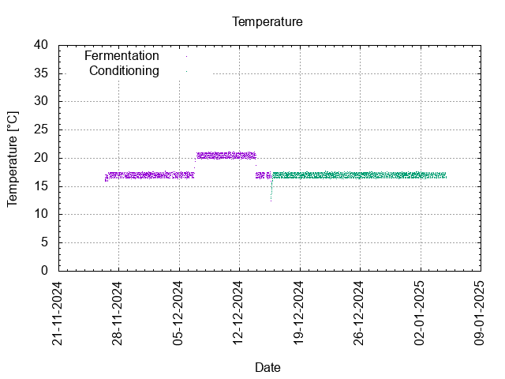
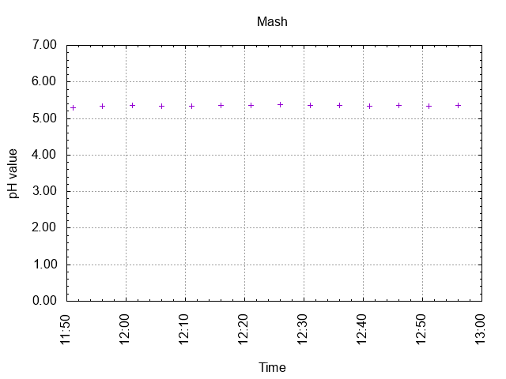
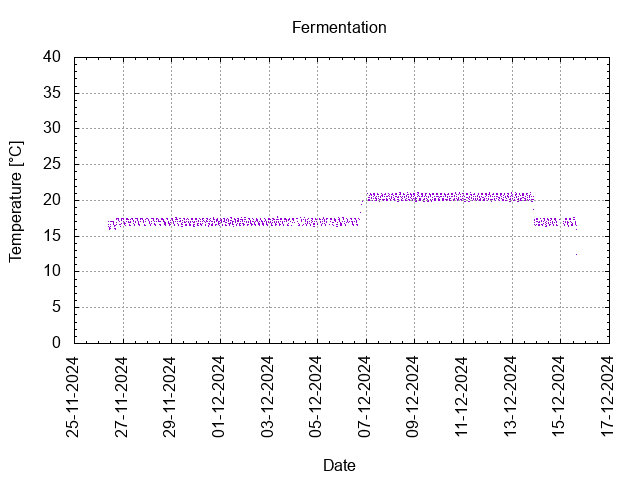
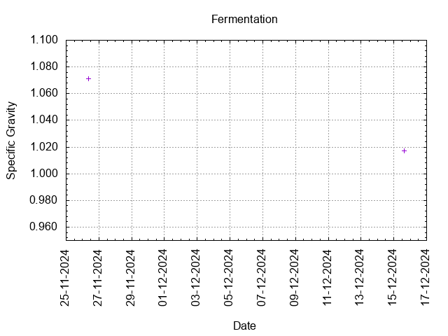
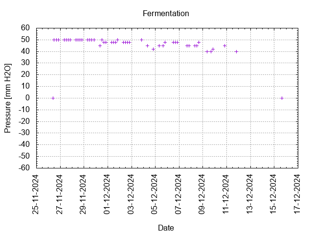
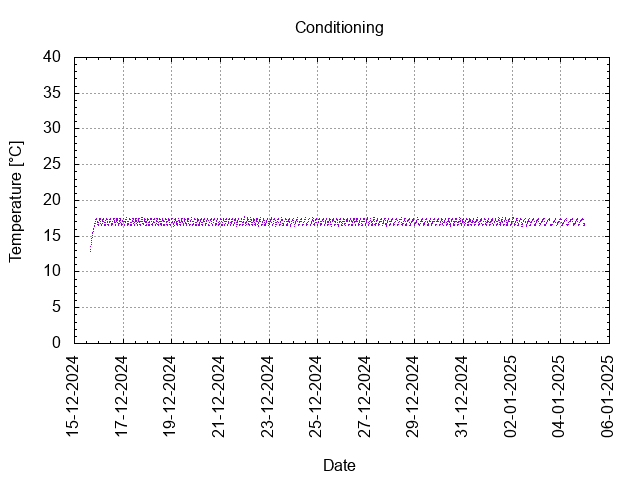
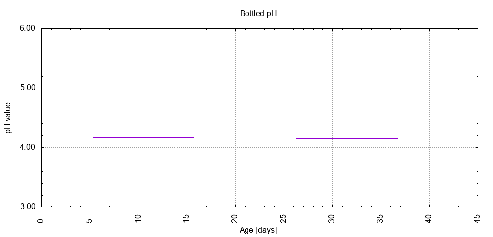

# Batch #41 - Refuse/Resist (Ukrainian Golden Ale)

## Milestones

25-11-2024 10:45 Start brewing.

26-11-2024 09:07 Start fermentation.

15-12-2024 15:38 Start conditioning.

26-01-2025 23:59 Completed conditioning.

Archived.

## Process

[Results](./Batch__results.pdf)

### Evaluation

|                         | Recipe | Batch | Diff   | Unit |
|-------------------------|--------|-------|--------|------|
| Pre-Boil Volume:        | 7.13   | 7.5   | +0.37  | L    |
| Post-Boil Volume (HOT): | 5.33   | 6.35  | +1.02  | L    |
| Boil Off per Hour:      | 1.8    | 1.15  | -0.65  | L    |
| Batch Volume:           | 5.0    | 3.95  | -1.05  | L    |
| Trub/Chiller Loss:      | 0.15   | 2.15  | +2.03  | L    |
| Bottling Volume:        | 4.4    |       |        | L    |
| Pre-Boil Gravity:       | 1.052  | 1.050 | -0.002 |      |
| Post-Boil Gravity:      | 1.070  | 1.063 | -0.007 |      |
| Original Gravity:       | 1.070  | 1.063 | -0.007 |      |
| Total Gravity:          | 1.072  | 1.074 | +0.002 |      |
| Final Gravity:          | 1.013  | 1.017 | +0.004 |      |
| Alcohol By Volume:      | 7.7    | 7.5   | -0.2   | %    |
| Apparent Attenuation:   | 81     | 75.9  | -5.1   | %    |
| Mash Efficiency:        | 74     | 74    | 0      | %    |
| Brewhouse Efficiency:   | 72     | 58    | -14    | %    |
| IBU:                    | 21     | 19    | -2     |      |
| BU/GU Ratio:            | 0.29   | 0.25  | -0.04  |      |
| RB Ratio:               | 0.30   | 0.25  | -0.05  |      |
| Color                   | 15.8   | 14    | -1.8   | EBC  |
| Mash pH:                | 5.37   | 5.34  | -0.03  |      |

## Tasting notes

| No. | Date       | Age | Score | Notes |
|-----|------------|-----|-------|-------|
|     | 15-12-2024 |   0 |       | Bottling day. |
|   1 | 26-01-2025 |  42 | 3.25  | Served at 18.8 C, low carbonation, decent head, good lacing,strong, grainy, biscuity, low on hops. |
|   2 | 16-03-2025 |     |       | Send to Clibit for evaluation. |
|   3 | 16-03-2025 |     |       | Send to Clibit for evaluation. |
|   4 |  |  |  |  |
|   5 |  |  |  |  |
|   6 |  |  |  |  |
|   7 |  |  |  |  |
|   8 |  |  |  |  |
|   9 |  |  |  |  |
