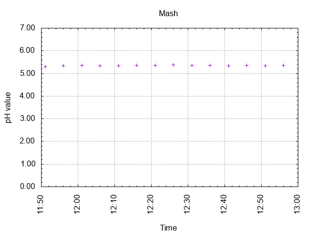
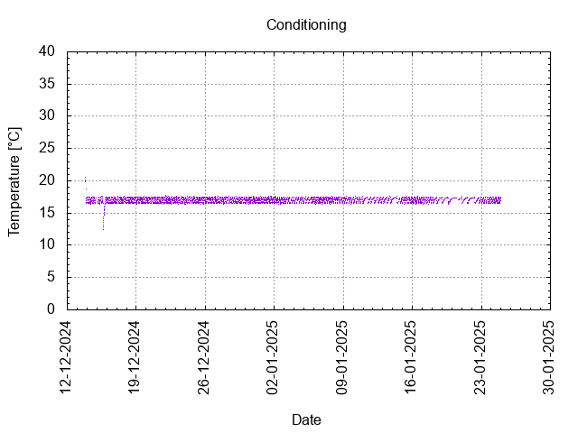
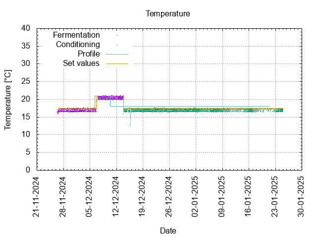
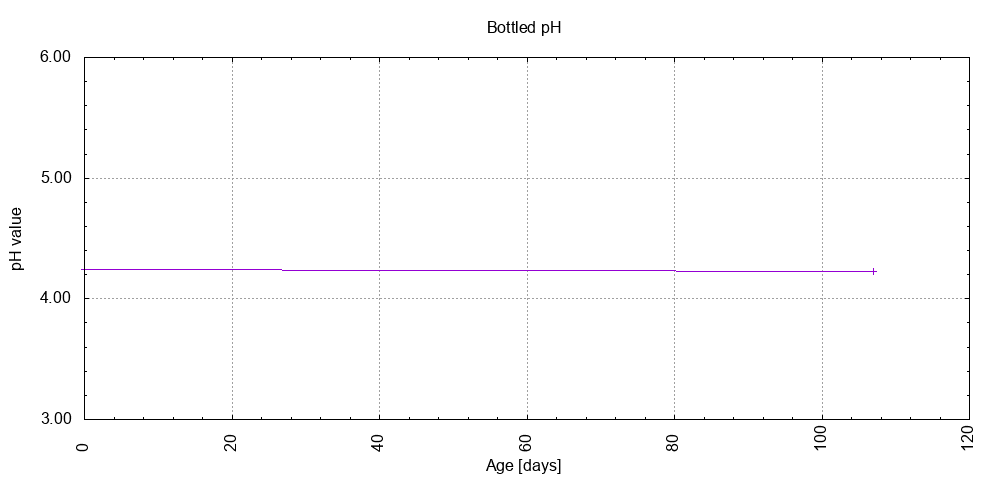

# Batch #43 - Refuse/Resist (Ukrainian Golden Ale) v3

## Milestones

25-11-2024 16:20 Start brewing.

26-11-2024 09:00 Start fermentation.

13-12-2014 17:14 Start conditioning.

24-01-2025 23:59 Completed conditioning.

Archived.

## Process

[Results](./Batch__results.pdf)

### Evaluation

|                         | Recipe | Batch | Diff   | Unit |
|-------------------------|--------|-------|--------|------|
| Batch Volume:           | 1.2    | 1.2   | 0      | L    |
| Trub/Chiller Loss:      | 0.6    | 0.6   | 0      | L    |
| Bottling Volume:        | 1.2    | 0.9   | -0.3   | L    |
| Original Gravity:       | 1.071  | 1.071 | 0      |      |
| Total Gravity:          | 1.073  | 1.074 | +0.001 |      |
| Final Gravity:          | 1.023  | 1.011 | -0.012 |      |
| Alcohol By Volume:      | 6.6    | 8.3   | +1.7   | %    |
| Apparent Attenuation:   | 67.1   | 84.3  | 17.2   | %    |
| Brewhouse Efficiency:   | 53     | 53    | 0      | %    |
| IBU:                    | 25     | 23    | -2     |      |
| BU/GU Ratio:            | 0.34   | 0.31  | -0.03  |      |
| RB Ratio:               | 0.31   | 0.33  | +0.02  |      |
| Color                   | 15.2   | 15.2  | 0      | EBC  |

## Tasting notes

| No. | Date       | Age | Score | Notes |
|-----|------------|-----|-------|-------|
|     | 13-12-2024 |   0 |       | Bottling day. |
|   1 | [30-03-2025](20250330_Batch_43_Refuse_Resist_Ukrainian_Golden_Ale_v3_BJCP_Scoresheet-1_3.pdf) | 107 |   3.0 | Strong, dry, carbonated. |
|   2 |  |  |  |  |
|   3 |  |  |  |  |
