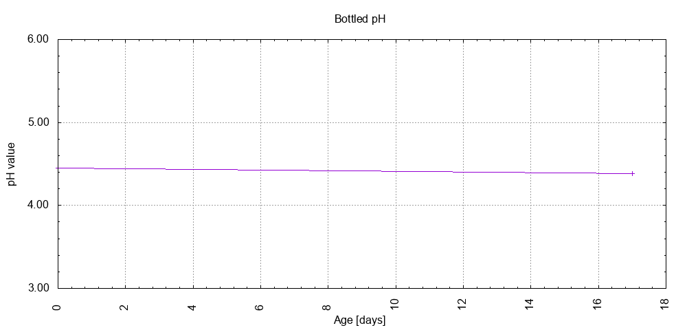

# Batch #44 - AnOtter Chocolate Caramel Biscuit

## Milestones

28-03-2025 09:30 Start brewing.

30-03-2025 17:15 Start fermentation.

14-04-2025 11:08 Start conditioning.

Completed conditioning.

Archived.

## Process

[Results](./Batch__results.pdf)

### Evaluation

|                         | Recipe | Batch | Diff   | Unit |
|-------------------------|--------|-------|--------|------|
| Pre-Boil Volume:        | 7.76   | 8.0   | +0.24  | L    |
| Post-Boil Volume (HOT): | 5.96   | 6.4   | +0.44  | L    |
| Boil Off per Hour:      | 1.8    | 1.6   | -0.2   | L    |
| Batch Volume:           | 5.6    | 3.0   | -2.6   | L    |
| Trub/Chiller Loss: 1)   | 0.12   | 3.14  | +3.02  | L    |
| Bottling Volume:        | 5.0    | 2.66  | -2.34  | L    |
| Pre-Boil Gravity:       | 1.038  | 1.041 | +0.003 |      |
| Post-Boil Gravity:      | 1.050  | 1.052 | +0.002 |      |
| Original Gravity:       | 1.050  | 1.052 | +0.002 |      |
| Final Gravity:          | 1.013  | 1.010 | -0.003 |      |
| Alcohol By Volume:      | 5.1    | 6.0   | +0.9   | %    |
| Apparent Attenuation:   | 74.2   | 81.4  | +7.2   | %    |
| Mash Efficiency:        | 73     | 82    | +9     | %    |
| Brewhouse Efficiency:   | 72     | 40    | -32    | %    |
| IBU:                    | 34     | 31    | -3     |      |
| BU/GU Ratio:            | 0.65   | 0.54  | -0.11  |      |
| RB Ratio:               | 0.63   | 0.57  | -0.06  |      |
| Color                   | 40.5   | 38.5  | -2     | EBC  |
| Mash pH:                | 5.40   | 5.35  | -0.05  |      |

1) Split off 1.2 L wort for each of batches #45 and #46.

## Tasting notes

| No. | Date       | Age | Score | Notes |
|-----|------------|-----|-------|-------|
|     | 14-04-2025 |   0 |       | Bottling day. |
|   1 | [01-05-2025](20250501_Batch_44_AnOtter Chocolate Caramel Biscuit_BJCP_Scoresheet-1_8.pdf) |  17 | 3.50  | A robust English porter, strong chocolate flavours, bitter clean, malty and strong. |
|   2 |            |     |       | . |
|   3 |            |     |       | . |
|   4 |            |     |       | . |
|   5 |            |     |       | . |
|   6 |            |     |       | . |
|   7 |            |     |       | . |
|   8 |            |     |       | . |
