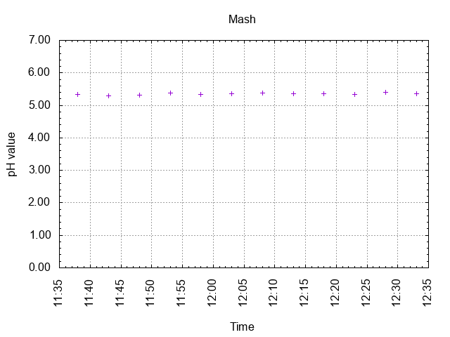
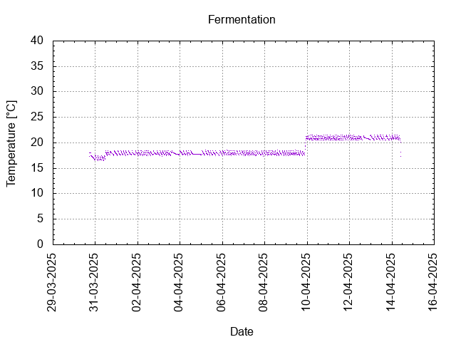
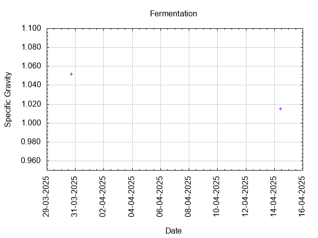
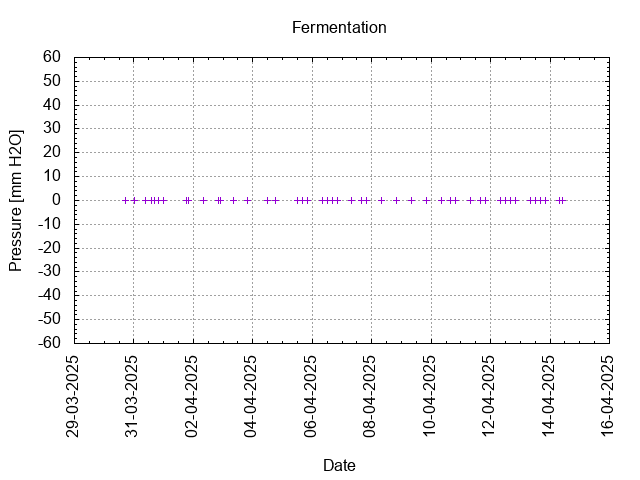
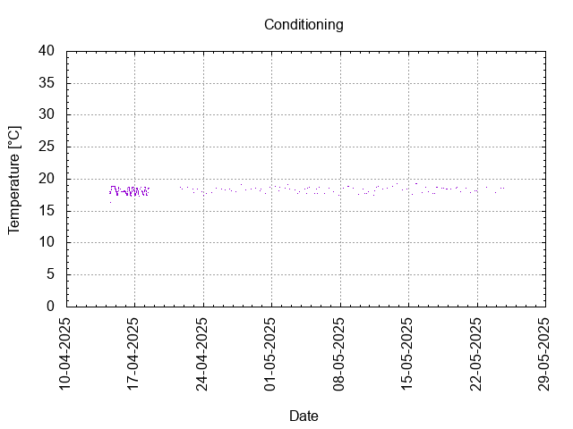
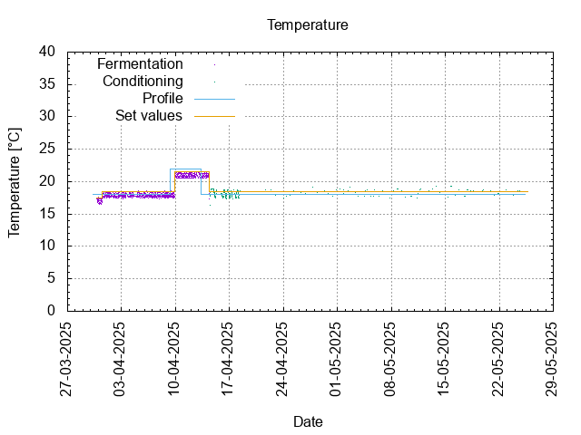
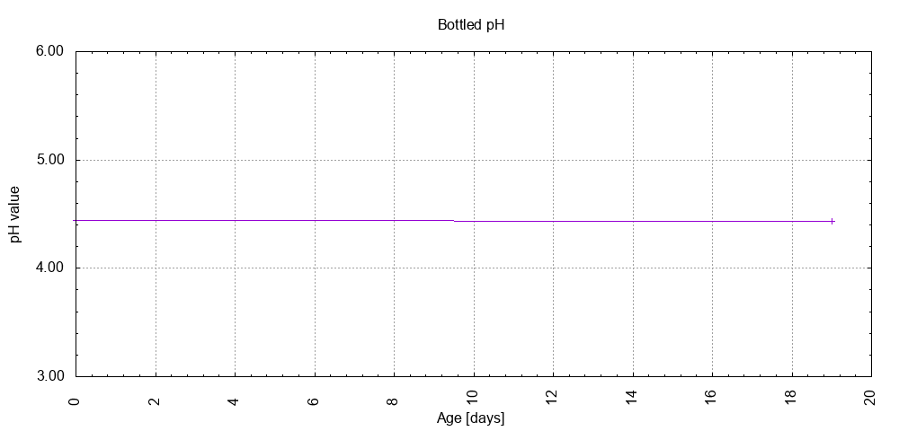

# Batch #45 - AnOtter Chocolate Caramel Biscuit v2

## Milestones

28-03-2025 09:30 Start brewing.

30-03-2025 17:15 Start fermentation.

14-04-2025 10:10 Start conditioning.

25-05-2025 16:30 Completed conditioning.

Archived.

## Process

[Results](Batch_45_AnOtter_Chocolate_Caramel_Biscuit_v2_results.pdf)

### Evaluation

|                         | Recipe | Batch | Diff   | Unit |
|-------------------------|--------|-------|--------|------|
| Batch Volume:           | 1.2    | 1.2   | 0      | L    |
| Trub Loss:              | 0.6    | 0.2   | -0.4   | L    |
| Bottling Volume:        | 1.2    | 1.0   | -0.2   | L    |
| Original Gravity:       | 1.050  | 1.052 | +0.002 |      |
| Final Gravity:          | 1.012  | 1.015 | +0.003 |      |
| Alcohol By Volume:      | 5.3    | 5.3   | 0      | %    |
| Apparent Attenuation:   | 76.1   | 71.8  | -4.3   | %    |
| Brewhouse Efficiency:   | 53     | 55    | +2     | %    |
| IBU:                    | 34     | 34    | 0      |      |
| BU/GU Ratio:            | 0.66   | 0.63  | -0.03  |      |
| RB Ratio:               | 0.66   | 0.60  | -0.06  |      |
| Color                   | 33.5   | 33.5  | 0      | EBC  |

## Tasting notes

| No. | Date       | Age | Score | Notes |
|-----|------------|-----|-------|-------|
|     | 14-04-2025 |   0 |       | Bottling day. |
|   1 | [03-05-2025](20250503_Batch_45_AnOtter Chocolate Caramel Biscuit_v2_BJCP_Scoresheet-1_3.pdf) |  19 | 3.50  | A robust English porter, strong chocolate flavours, bitter clean, malty and strong. |
|   2 |            |     |       | . |
|   3 |            |     |       | . |
