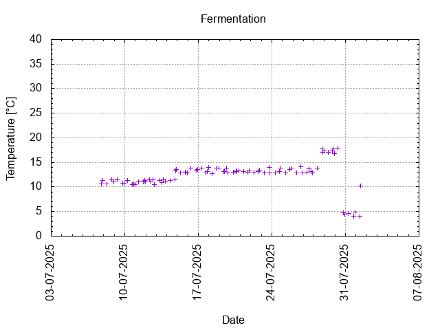

# Batch #47 - Bock Dich, Befehl Ich Dir

## Milestones

06-07-2025 Start brewing.

07-07-2025 Start fermentation.

01-08-2025 Start conditioning.

Completed conditioning.

Archived.

## Process

[Results](Batch_47_Bock_Dich_Befehl_Ich_Dir_results.pdf)

### Evaluation

|                         | Recipe | Batch | Diff   | Unit |
|-------------------------|--------|-------|--------|------|
| Pre-Boil Volume:        | 8.21   | 8.85  | +0.64  | L    |
| Post-Boil Volume (HOT): | 5.96   | 7.00  | +1.04  | L    |
| Boil Off per Hour:      | 1.80   | 1.48  | -0.32  | L    |
| Batch Volume:           | 5.60   | 4.20  | -1.40  | L    |
| Trub/Chiller Loss: 1)   | 0.12   | 2.52  | -2.4   | L    |
| Bottling Volume:        | 5.00   | 2.66  | -2.34  | L    |
| Pre-Boil Gravity:       | 1.048  | 1.041 | -0.007 |      |
| Post-Boil Gravity:      | 1.067  | 1.064 | -0.003 |      |
| Original Gravity:       | 1.067  | 1.064 | -0.003 |      |
| Final Gravity:          | 1.013  | 1.015 | +0.002 |      |
| Alcohol By Volume:      | 7.1    | 6.4   | -0.7   | %    |
| Apparent Attenuation:   | 79.7   | 65.7  | -4.1   | %    |
| Mash Efficiency:        | 73     | 67    | -6     | %    |
| Brewhouse Efficiency:   | 72     | 52    | -20    | %    |
| IBU:                    | 36     | 34    | -2     |      |
| BU/GU Ratio:            | 0.53   | 0.53  | 0      |      |
| RB Ratio:               | 0.55   | 0.52  | -0.03  |      |
| Color                   | 11.8   | 10.6  | -1.2   | EBC  |
| Mash pH:                | 5.40   | 5.33  | -0.07  |      |

1) Split off 1.2 L wort for each of batches #48 and #49.

## Tasting notes

| No. | Date       | Age | Score | Notes |
|-----|------------|-----|-------|-------|
|     | 01-08-2025 |   0 |       | Bottling day. |
|   1 | 02-08-2025 |   1 |       | Bottled in a pastic bottle. Sent to Chug for the HBUK competition. First up was Thirsty's Maibock, which was the last to arrive and freshly brewed so could have been different with a few more weeks conditioning. Appearance:- Slight haze but given its youth may clear and have a nice golden colour, no real head and no bubbles. Aroma:- I got stewed fruit, reminded me of my plum and apple wine along with slight winey/alcoholy nose that hinted at a strong beer. Flavour:- Tasted strong but not overly alcoholy, at first seems slightly sweet/malty but a moderate bitterness cuts in and leaves a sweet but dryish, slightly warming finish with fruity overtones. Mouthfeel:- low carbonation but medium to full bodied and reasonably smooth, for some reason I was reminded of port in the aftertaste. Overall:- Strong, sweet, malty, fruity and warming. |
|   2 | 02-08-2025 |   1 |       | Bottled in a pastic bottle. Sent to Chug for the HBUK competition. First up was Thirsty's Maibock, which was the last to arrive and freshly brewed so could have been different with a few more weeks conditioning. Appearance:- Slight haze but given its youth may clear and have a nice golden colour, no real head and no bubbles. Aroma:- I got stewed fruit, reminded me of my plum and apple wine along with slight winey/alcoholy nose that hinted at a strong beer. Flavour:- Tasted strong but not overly alcoholy, at first seems slightly sweet/malty but a moderate bitterness cuts in and leaves a sweet but dryish, slightly warming finish with fruity overtones. Mouthfeel:- low carbonation but medium to full bodied and reasonably smooth, for some reason I was reminded of port in the aftertaste. Overall:- Strong, sweet, malty, fruity and warming. |
|   3 | 07-09-2025 |  37 | 3.5   | Hazy, not too strong on hops, sweet and hints of yeast. Lasting foam and lacing. |
|   4 |            |     |       | . |
|   5 |            |     |       | . |
|   6 |            |     |       | . |
|   7 |            |     |       | . |
|   8 |            |     |       | . |
