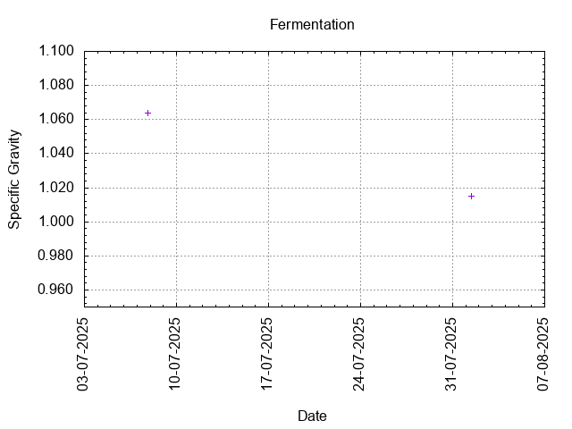

# Batch #48 - Bock Dich, Befehl Ich Dir v2

## Milestones

06-07-2025 14:46 Start brewing.

07-07-2025 08:57 Start fermentation.

01-08-2025 09:24 Start conditioning.

25-09-2025 08:00 Completed conditioning.

Archived.

## Process

[Results](Batch_48_Bock_Dich_Befehl_Ich_Dir_v2_results.pdf)

### Evaluation

|                         | Recipe | Batch | Diff   | Unit |
|-------------------------|--------|-------|--------|------|
| Batch Volume:           | 1.2    | 1.2   |  0     | L    |
| Trub/Chiller Loss:      | 0.6    | 0.6   |  0     | L    |
| Bottling Volume:        | 1.2    | 1.0   | -0.2   | L    |
| Original Gravity:       | 1.067  | 1.064 | -0.003 |      |
| Final Gravity:          | 1.013  | 1.014 | +0.001 |      |
| Alcohol By Volume:      | 7.1    | 6.6   | -0.5   | %    |
| Apparent Attenuation:   | 79.7   | 77.2  | -2.5   | %    |
| Brewhouse Efficiency:   | 72     | 52    | -20    | %    |
| IBU:                    | 36     | 36    |  0     |      |
| BU/GU Ratio:            | 0.53   | 0.56  | +0.03  |      |
| RB Ratio:               | 0.55   | 0.56  | +0.01  |      |
| Color                   | 11.2   | 11.2  |  0     | EBC  |
| Mash pH:                | 5.40   | 5.33  | -0.07  |      |

## Tasting notes

| No. | Date       | Age | Score | Notes |
|-----|------------|-----|-------|-------|
|     |            |   0 |       | Bottling day. |
|   1 | 03-10-2025 |  63 | 3.25  | Served @ 14.4 C. Malty, yeasty, grassy. Fine bubbles, low carbonation. |
|   2 |            |     |       | . |
|   3 |            |     |       | . |
