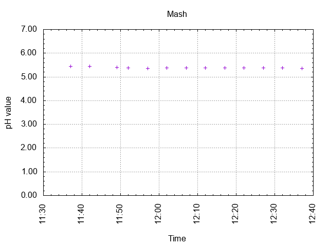
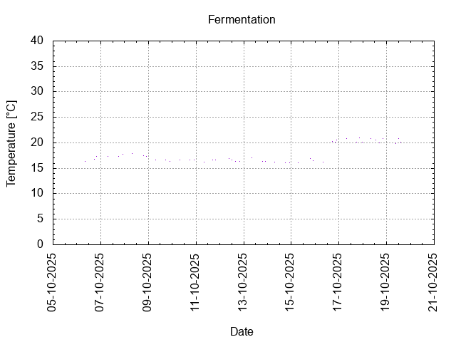
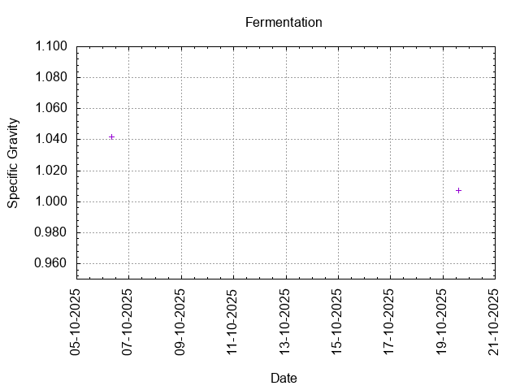
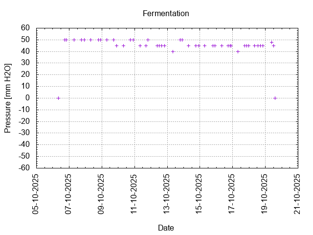
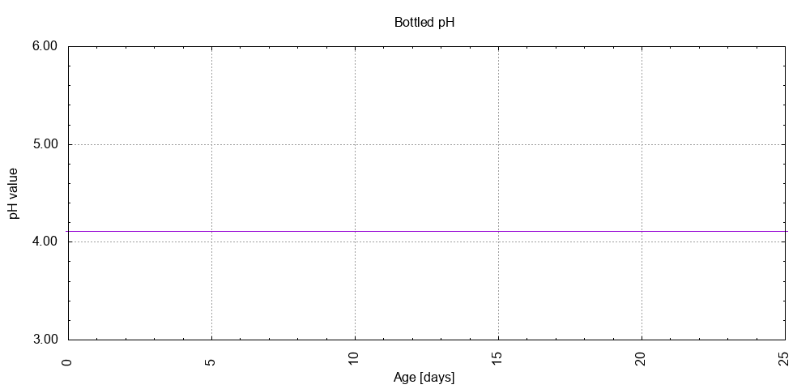

# Batch #50 - SMaSH Godiva v3 

## Milestones

05-10-2025 10:00 Start brewing.

06-10-2025 07:45 Start fermentation.

19-10-2025 14:29 Start conditioning.

01-12-2025 08:00 Completed conditioning.

Archived.

## Process

[Results](Batch_50_SMaSH_Godiva_v3_results.pdf)

### Evaluation

|                         | Recipe | Batch | Diff   | Unit |
|-------------------------|--------|-------|--------|------|
| Pre-Boil Volume:        | 7.76   | 8.55  | +0.79  | L    |
| Post-Boil Volume (HOT): | 5.96   | 7.00  | +1.04  | L    |
| Boil Off per Hour:      | 1.80   | 1.55  | -0.25  | L    |
| Batch Volume:           | 5.60   | 2.67  | -2.93  | L    |
| Trub/Chiller Loss: 1)   | 0.12   | 4.05  | +3.93  | L    |
| Bottling Volume:        | 5.0    | 2.5   | -2.5   | L    |
| Pre-Boil Gravity:       | 1.030  | 1.025 | -0.005 |      |
| Post-Boil Gravity:      | 1.039  | 1.042 | +0.003 |      |
| Original Gravity:       | 1.039  | 1.042 | +0.003 |      |
| Total Gravity:          | 1.041  | 1.046 | +0.005 |      |
| Final Gravity:          | 1.009  | 1.007 | -0.002 |      |
| Alcohol By Volume:      | 4.2    | 5.1   | +0.9   | %    |
| Apparent Attenuation:   | 77.4   | 84.3  | +6.9   | %    |
| Mash Efficiency:        | 73     | 67    | -6     | %    |
| Brewhouse Efficiency:   | 72     | 37    | -35    | %    |
| IBU:                    | 40     | 37    | -3     |      |
| BU/GU Ratio:            | 0.97   | 0.80  | -0.17  |      |
| RB Ratio:               | 0.98   | 0.86  | -0.12  |      |
| Color                   | 7.1    | 6.3   | -0.8   | EBC  |
| Mash pH:                | 5.37   | 5.39  | +0.02  |      |

1) Split off 1.2 L wort for each of batches #51 and #52.

## Tasting notes

| No. | Date       | Age | Score | Notes |
|-----|------------|-----|-------|-------|
|     |            |   0 |       | Bottling day. |
|   1 | 13-11-2025 |  25 | 3.25  | Hoppy and malty. |
|   2 |            |     |       |  |
|   3 |            |     |       |  |
|   4 |            |     |       |  |
|   5 |            |     |       |  |
|   6 |            |     |       |  |
|   7 |            |     |       |  |
|   8 |            |     |       |  |
|   9 |            |     |       |  |
