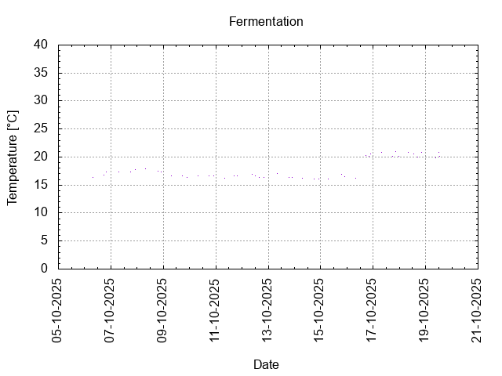
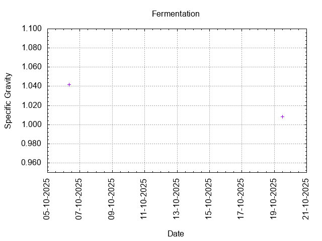
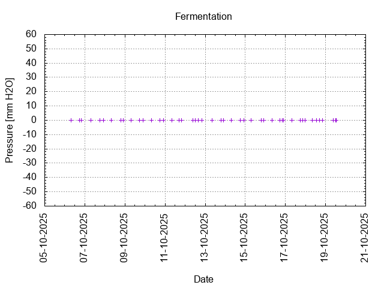
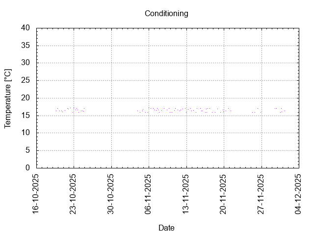
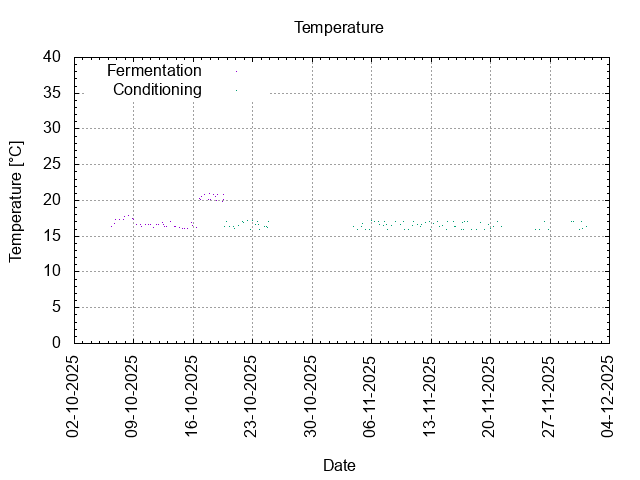
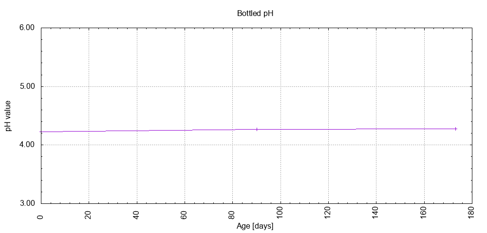

# Batch #51 - Two Pints and a Packet of Hops (Godiva and Goldings)

## Milestones

05-10-2025 10:00 Start brewing.

06-10-2025 07:51 Start fermentation.

19-10-2025 12:44 Start conditioning.

01-12-2025 08:00 Completed conditioning.

Archived.

## Process

[Results](Batch_51_Two_Pints_and_a_Packet_of_Hops_Godiva_and_Goldings_results.pdf)

### Evaluation

|                         | Recipe | Batch | Diff   | Unit |
|-------------------------|--------|-------|--------|------|
| Batch Volume:           | 0.75   | 1.0   | +0.25  | L    |
| Bottling Volume:        | 0.75   | 1.0   | +0.25  | L    |
| Original Gravity:       | 1.039  | 1.042 | +0.003 |      |
| Final Gravity:          | 1.009  | 1.008 | -0.001 |      |
| Alcohol By Volume:      | 4.2    | 4.7   | +0.5   | %    |
| Apparent Attenuation:   | 77.4   | 81.3  | +3.9   | %    |
| Brewhouse Efficiency:   | 95     | 137   | +42    | %    |
| IBU:                    | 25     | 25    | 0      |      |
| BU/GU Ratio:            | 0.62   | 0.58  | -0.04  |      |
| RB Ratio:               | 0.63   | 0.61  | -0.01  |      |
| Color                   | 5.9    | 5.9   | 0      | EBC  |
| Mash pH:                | 5.37   | 5.39  | +0.02  |      |

## Tasting notes

| No. | Date       | Age | Score | Notes |
|-----|------------|-----|-------|-------|
|     | 19-10-2025 |   0 |       | Bottling day. |
|   1 | [17-01-2026](20260117_Batch_51_Two_Pints_and_a_Packet_of_Hops_Godiva_and_Goldings_BJCP_Scoresheet-1_3.pdf) |  90 |  3.00 | Hoppy, bitter, dry. |
|   2 | [10-04-2026](20260410_Batch_51_Two_Pints_and_a_Packet_of_Hops_Godiva_and_Goldings_BJCP_Scoresheet-2_3.pdf) | 173 |  3.00 | Hazy, hoppy, bitter, dry. |
|   3 |            |     |       | . |
