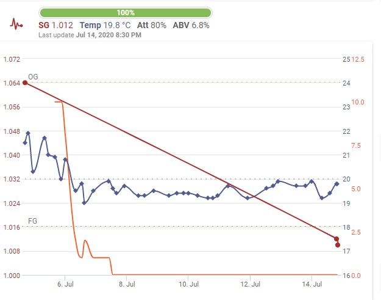

# Bottling day @ July 14th 2020

I bottled my second batch today, this time the "Brouwpunt Kruidig Wit",
a spicy Witbier with Coriander and bitter Orange peel shavings.

OG was a bit high with 1.064 (after correction for temperature) and
spending 10 days in the FV it came to a FG of 1.012.

If calculated correct this would result in an ABV of 6.8 %.

After preparing bottling sugar SG became 1.010.

Sedimentation was better than last time, a more clear and straw yellow
brew, which at my first batch was caramel colored and cloudy.

