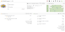

# Brew day @ April 30th, 2025

A SMaSH brew with Muntons Maris Otter malt and Fuggles hops, fermented with
Fermentis S-04 English ale yeast.

It was a brew of two halves, separated by watching the F1 race.
 
Mashing went fine except for the batch sparge, the 1.8 L water heater I used to
use for heating the sparge water had died and SWMBO thought it a good idea to
have a smaller 1 L heater as to preserve some energy and keep them energy bills
low.
 
So that's where the faffing started.
 
My mash target was 7.76 L of 1.030, instead I ended up with 8.25 L of 1.026.
 
Used a total of 8.7 L of water on 1 kg of grist, I still can't account for the
extra 0.25 L given the 0.7 L/kg absorbtion I normally see.
 
Anyway I thought not much of it, boil a bit longer and problem solved ... and
thus up the energy bill for natural gas a bit (SWMBO doesn't know it's a
zero-sum game).
 
The boil was pretty straight forward, all additions on time in full.
 
Another faffy thing was the Fuggle leaf hops in hop socks.
 
I thought it a good idea to use hop socks to prevent the strainer from clogging
up when I fill the fermenter with wort.
 
Straight from the pot, at elevation into the FV to have a good splash.
 
These hop socks in combination with leaves truly give an serious amount of trub
loss ... adding more faff.
 
Ended up with 5.2 L wort of 1.044 (target 5.96 L @ 1.039).
 
Then split off some 1.7 L for faffing with different (dry) hops in another FV,
so ended up with 3.5 L in this Batch.
 
Scores on the door:

