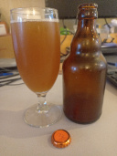

# Beer tasting day @ July 30th, 2023

A split off batch from my first raw ale brew.

Today I tasted another possible candidate for the comp, a Norwegian
style raw ale (kornøl) with even more Juniper berries added during primary fermentation.

Yeasty tarty aroma, with a malty flavor with pronounced presence of
Juniper.
Not a sweet malt flavor but tart, almost like a sour or a witbier.
Low carbonation with good lacing and very small bubbles.
A bit cloudy again.
All in all a nice juniper ale.
