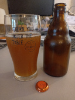

# Beer tasting day @ August 3rd, 2023

A second split off batch from my first raw ale brew.

Today I tasted another possible candidate for the comp, a Norwegian
style raw ale (kornøl) with even more more Juniper berries added during
primary fermentation.

Yeasty tarty aroma, with a malty flavor with a very pronounced presence
of Juniper.
Sweet malt flavor but tart, low carbonation with small foam and no
lacing and very small bubbles.
A bit cloudy again.
A bit over the top with Juniper.
