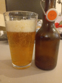

# Beer tasting day @ September 15th, 2023

A British Golden Ale with Muntons Maris Otter malt and Fuggle hop cones.

Dry hopped with Progress hop pellets.

Fermented with Fermentis S-04 English Ale yeast.

A clean, malty, fruity, hoppy ale.

