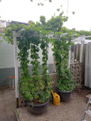

# Hops harvest day @ September 16th, 2023

This year's harvest was mostly Willamette hops, 788 grams (wet).

Bramling-X gave me 361 grams (wet).

A small amount of Bramling-X hops was intertwined with the Willamette and
could not be kept separate, another 282 grams mixed hops (wet).

All together it was 1431 grams (wet), of which 180 grams goes in the Willamette
wet hops Blonde Ale brew of tomorrow, and the rest was dried, vacuum sealed and
stored in the freezer.

