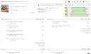
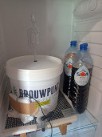

# Brew day @ March 28th, 2025

Today's brew happily bubbling through the airlock ... AnOtter Chocolate Caramel
Biscuit ... an English porter.

Recipe loosely based on a recipe I got from Clibit.

Split off two 1.2 L experimental batches with Lallemand Nottingham yeast and
Lallemand Windsor yeast to see what works best.
 
Since I had an overshoot in the amount of wort, the IBU have dropped to 35.

