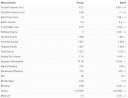

# Brew day @ July 6th, 2025

I did my HBUK comp brew today, a postponed Maibock of about 7% ABV.

Things went well, came 3 points under OG and 8 % more volume in the fermenter.

Now cooling down overnight, tomorrow up early to pitch yeast.

