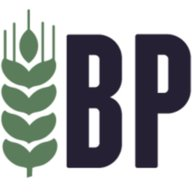

# Brouwpunt - Kruidig Wit

Style: 24A Witbier

ABV: 4.9 %

IBU: 11

EBC: 7.7

Original Gravity: 1.052

Final Gravity 1.015

Batch size: 5 L

## Mash

Source profile: NL Hoofddorp Rein Tap Water (2020-Q1 WQR)

Target profile: Mild Ale Profile

| Ca 2+ | Mg 2+ | Na + | Cl - | SO4 2- | HCO3 |     |
|-------|-------|------|------|--------|------|-----|
| 51    | 9     | 67   | 18   | 44     | 178  | ppm |

Mash pH: 6.01 (too high because of using tap water and no addition of water agents)

Strike temperature @ 73.3 C

60 minutes @ 67 C

630 grams Brouwpunt Pilsen malt (pre-milled, pre-mixed)

630 grams Brouwpunt Wheat malt (pre-milled, pre-mixed)

## Boil

60 minutes

10 grams Saaz (A.A. 3.1 % whole) @ 30 minutes (10.9 IBU)

5 grams Orange Peel, Bitter @ 55 minutes

5 grams Coriander Seed @ 55 minutes

## Fermentation

0.5 package Fermentis S-33 SafBrew Ale yeast

Primary @ 20 C for 14 days

## Bottling

30 gram Table Sugar for 2.4 % carbonation

## Conditioning

Conditioning @ 20 C for 45 days
